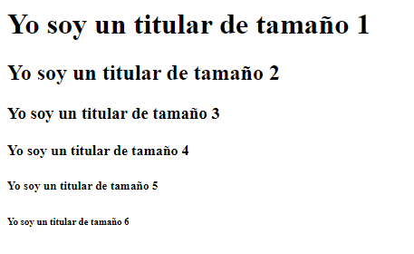
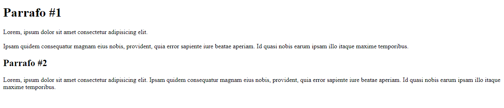
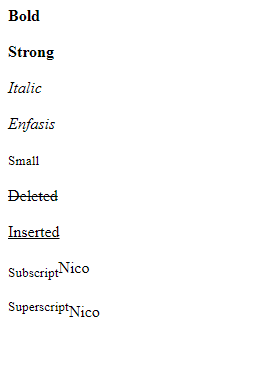
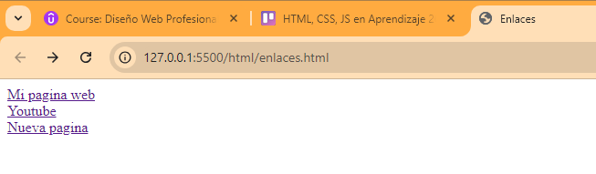
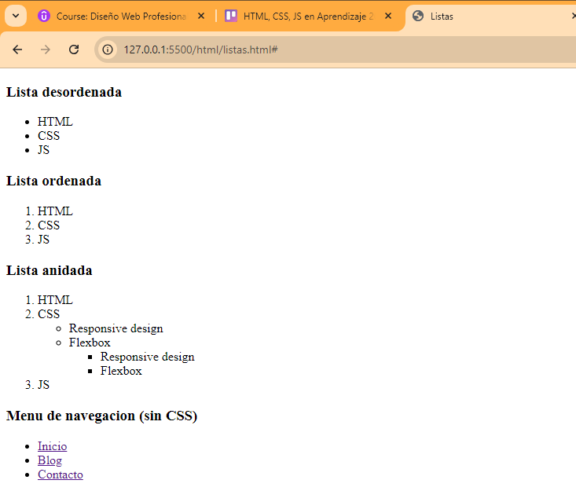
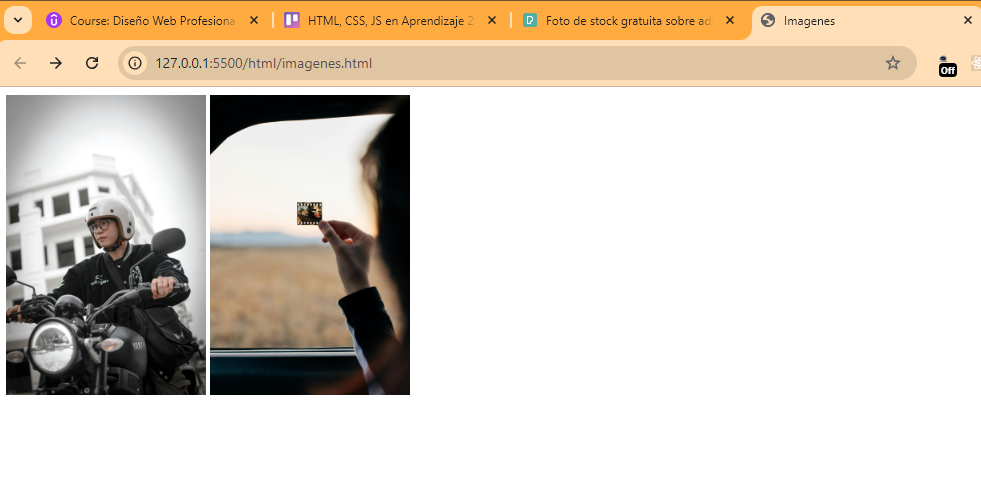
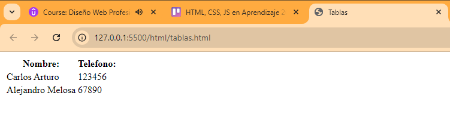
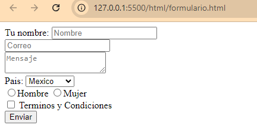
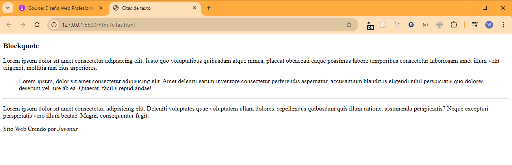

# SECCION 3: HTML

# 9. Herramientas que utilizaremos

# 10. Hola Mundo y estructura basica de un sitio web

```html
<!DOCTYPE html>
<html lang="es">
  <head>
    <meta charset="UTF-8" />
    <title>Mi primera pagina web</title>
  </head>
  <body>
    <h1>Hola Mundo!</h1>
    <!-- Nota: h1 nos sirve para agregar un encabezado -->
  </body>
</html>
```

# 11. Encabezados

```html
<!DOCTYPE html>
<html lang="es">
  <head>
    <meta charset="UTF-8" />
    <title>Titulares</title>
  </head>
  <body>
    <h1>Yo soy un titular de tamaño 1</h1>
    <h2>Yo soy un titular de tamaño 2</h2>
    <h3>Yo soy un titular de tamaño 3</h3>
    <h4>Yo soy un titular de tamaño 4</h4>
    <h5>Yo soy un titular de tamaño 5</h5>
    <h6>Yo soy un titular de tamaño 6</h6>
  </body>
</html>
```



# 12. Parrados de texto

```html
<!DOCTYPE html>
<html lang="es">
  <head>
    <meta charset="UTF-8" />
    <title>Parrafos</title>
  </head>
  <body>
    <p>
        <h1>Parrafo #1</h1>
      Lorem, ipsum dolor sit amet consectetur adipisicing elit.

      <!-- Estos son saltos de linea -->
      <br><br>
      Ipsam quidem consequatur magnam eius nobis, provident, quia error sapiente iure beatae
      aperiam. Id quasi nobis earum ipsam illo itaque maxime temporibus.
    </p>
    <p>
        <h2>Parrafo #2</h2>
      Lorem, ipsum dolor sit amet consectetur adipisicing elit. Ipsam quidem
      consequatur magnam eius nobis, provident, quia error sapiente iure beatae
      aperiam. Id quasi nobis earum ipsam illo itaque maxime temporibus.
    </p>
  </body>
</html>
```



# 13. Etiquetas de texto

```html
<!DOCTYPE html>
<html lang="es">
  <head>
    <meta charset="UTF-8" />
    <title>Etiquetas para texto</title>
  </head>
  <body>
    <p>
      <!-- Negritas, No tiene importancia semantica -->
      <b>Bold</b>
      <br /><br />

      <!--Negritas,  Si tiene importancia semantica -->
      <strong>Strong</strong>
      <br /><br />

      <!-- italico, No tiene importancia semantica -->
      <i>Italic</i>
      <br /><br />

      <!--italico,  Si tiene importancia semantica -->
      <em>Enfasis</em>
      <br><br>

      <small>Small</small>
      <br><br>

      <del>Deleted</del>
      <br><br>

      <ins>Inserted</ins>
      <br><br>

      <sub>Subscript</sub>Nico
      <br><br>

      <sup>Superscript</sup>Nico
    </p>
  </body>
</html>
```



# 14. Enlaces

```html
<!DOCTYPE html>
<html lang="es">
  <head>
    <meta charset="UTF-8" />
    <title>Enlaces</title>
  </head>
  <body>
    <a href="https://google.com">Mi pagina web</a>
    <br>
    <a href="https://youtube.com" target="_blank">Youtube</a>
    <br>
    <a href="holamundo.html" target="_blank">Nueva pagina</a>
  </body>
</html>
```



# 15. Listas

```html
<!DOCTYPE html>
<html lang="es">
  <head>
    <meta charset="UTF-8" />
    <meta name="viewport" content="width=device-width, initial-scale=1.0" />
    <title>Listas</title>
  </head>
  <body>
    <h3>Lista desordenada</h3>
    <ul>
      <li>HTML</li>
      <li>CSS</li>
      <li>JS</li>
    </ul>

    <h3>Lista ordenada</h3>
    <ol>
      <li>HTML</li>
      <li>CSS</li>
      <li>JS</li>
    </ol>

    <h3>Lista anidada</h3>
    <ol>
      <li>HTML</li>
      <li>
        CSS
        <ul>
          <li>Responsive design</li>
          <li>
            Flexbox
            <ul>
              <li>Responsive design</li>
              <li>Flexbox</li>
            </ul>
          </li>
        </ul>
      </li>
      <li>JS</li>
    </ol>

    <h3>Menu de navegacion (sin CSS)</h3>
    <ul>
        <li><a href="#">Inicio</a></li>
        <li><a href="#">Blog</a></li>
        <li><a href="#">Contacto</a></li>
    </ul>
  </body>
</html>
```



# 16. Imagenes

```html
<!DOCTYPE html>
<html lang="es">
<head>
    <meta charset="UTF-8">
    <meta name="viewport" content="width=device-width, initial-scale=1.0">
    <title>Imagenes</title>
</head>
<body>
    

    <a href="https://www.google.com" target="_blank">
        
    </a>
</body>
</html>
```



# 17. Tablas

```html
<!DOCTYPE html>
<html lang="es">
  <head>
    <meta charset="UTF-8" />
    <title>Tablas</title>
  </head>
  <body>
    <table>
      <tr>
        <th>Nombre:</th>
        <th>Telefono:</th>
      </tr>
      <tr>
        <td>Carlos Arturo</td>
        <td>123456</td>
      </tr>
      <tr>
        <td>Alejandro Melosa</td>
        <td>67890</td>
      </tr>
    </table>
  </body>
</html>
```



# 18. Formularios

```html
<!DOCTYPE html>
<html lang="es">

<head>
    <meta charset="UTF-8" />
    <title>Formularios</title>
</head>

<body>
    <form action="" method="">
        <label for="nombre">Tu nombre:</label>
        <input type="text" id="nombre" placeholder="Nombre" maxlength="10" name="nombre" required />
        <br />
        <input type="email" placeholder="Correo" name="correo" />
        <br />
        <textarea name="mensaje" id="mensaje" placeholder="Mensaje"></textarea>
        <br />

        <label for="pais">Pais:</label>
        <select name="pais" id="pais">
            <option value="mexico">Mexico</option>
            <option value="españa">España</option>
            <option value="argentina">Argentina</option>
        </select>
        <br />

        <input type="radio" name="genero" value="hombre" id="hombre" /><label for="hombre">Hombre</label>
        <input type="radio" name="genero" value="mujer" id="mujer" /><label for="mujer">Mujer</label>
        <br />

        <input type="checkbox" name="tarminos" id="termino" /><label for="termino">
            Terminos y Condiciones</label>
        <br />
        <input type="submit" value="Enviar" />
    </form>
</body>

</html>
```

El atributo action especifica la URL a la que se enviarán los datos del formulario cuando se envíen. Esta URL puede ser una página en el mismo servidor o en un servidor diferente. El valor de action puede ser:

- Una URL absoluta: por ejemplo, https://example.com/submit-form.
- Una URL relativa: por ejemplo, /submit-form (donde /submit-form es relativo a la raíz del sitio web).
- O estar vacío: si no se especifica, el formulario se enviará a la misma URL de la página que contiene el formulario.

El atributo method especifica el método HTTP que se utilizará para enviar los datos del formulario. Los valores más comunes son:

- GET: Envía los datos del formulario como parámetros de URL. Es útil para solicitudes donde los datos del formulario no son sensibles (como en búsquedas). Es limitado en la cantidad de datos que puede enviar porque los datos se envían en la URL.

```html
<form action="/search" method="GET">
  <input type="text" name="query" placeholder="Buscar...">
  <button type="submit">Buscar</button>
</form>
```

En este ejemplo, si el usuario busca "gato", la URL se convertirá en algo como https://tu-dominio.com/search?query=gato.

POST: Envía los datos del formulario en el cuerpo de la solicitud HTTP. Este método es más seguro que GET para enviar datos sensibles (como contraseñas) y no tiene límite práctico en la cantidad de datos que se pueden enviar.

**¿Qué es una solicitud HTTP?**

Cuando un navegador web (o cualquier cliente) se comunica con un servidor, envía una solicitud HTTP. Esta solicitud puede incluir diferentes tipos de información, como:

- Línea de solicitud: Indica el método HTTP (GET, POST, etc.), la URL solicitada y la versión de HTTP.
- Cabeceras: Contienen información adicional sobre la solicitud, como el tipo de contenido, longitud del contenido, cookies, etc.
- Cuerpo: Es la parte de la solicitud donde se envían los datos adicionales. Esto solo se aplica a ciertos métodos como POST, PUT, etc.

**Método POST y el Cuerpo de la Solicitud**

Cuando usas el método POST en un formulario HTML, los datos que el usuario ha ingresado en los campos del formulario se envían dentro del cuerpo de la solicitud HTTP. Esto significa que estos datos no son visibles en la URL, a diferencia del método GET, donde los datos se añaden como parámetros en la URL.

Supongamos que tienes un formulario como este:

```html
<form action="/login" method="POST">
  <input type="text" name="username" placeholder="Nombre de usuario">
  <input type="password" name="password" placeholder="Contraseña">
  <button type="submit">Iniciar sesión</button>
</form>
```

Si un usuario ingresa "juan123" como nombre de usuario y "miPassword" como contraseña y luego envía el formulario, el navegador enviará una solicitud HTTP al servidor que podría verse así:


    POST /login HTTP/1.1
    Host: www.ejemplo.com
    Content-Type: application/x-www-form-urlencoded
    Content-Length: 35

    username=juan123&password=miPassword

**Línea de solicitud: POST /login HTTP/1.1**

    - POST es el método utilizado.
    - /login es la URL a la que se envían los datos.
    - HTTP/1.1 es la versión del protocolo HTTP utilizada.

**Cabeceras: Incluyen información adicional sobre la solicitud.**

    - Host: www.ejemplo.com indica el servidor al que se envía la solicitud.
    - Content-Type: application/x-www-form-urlencoded especifica que los datos del formulario se han codificado de la manera estándar para formularios HTML.
    - Content-Length: 35 indica la longitud de los datos que se están enviando en el cuerpo de la solicitud.

**Cuerpo: Aquí es donde se encuentran los datos del formulario. En este caso:**

    - username=juan123&password=miPassword
    - Este es el formato típico de datos de formulario (application/x-www-form-urlencoded), donde cada campo de formulario se representa como un par clave=valor y los pares están separados por &.



# 19. Tipos de Input

Recursos: 

- https://caniuse.com/

```html
<!DOCTYPE html>
<html lang="es">

<head>
    <meta charset="UTF-8">
    <title>Inputs</title>
</head>

<body>
    <form action="" method="">
        <input type="password" placeholder="Contraseña" maxlength="10">
        <br>
        <input type="color" name="color">
        <br>
        <input type="email" placeholder="email" required name="email">
        <br>
        <input type="number" min="5" max="9" name="numero">
        <br>
        <input type="range" min="0" max="10" name="rango">
        <br>
        <input type="url" name="url" placeholder="Sitio web">
        <br>
        <input type="submit">
    </form>
</body>

</html>
```

# 20. Etiquetas para citas de texto

```html
<!DOCTYPE html>
<html lang="es">

<head>
    <meta charset="UTF-8">
    <meta name="viewport" content="width=device-width, initial-scale=1.0">
    <title>Citas de texto</title>
</head>

<body>
    <h3>Blockquote</h3>
    <p>
        Lorem ipsum dolor sit amet consectetur adipisicing elit. Iusto quo voluptatibus quibusdam atque minus, placeat
        obcaecati eaque possimus labore temporibus consectetur laboriosam amet illum velit eligendi, mollitia nisi eius
        asperiores.
    </p>
    <blockquote>
        Lorem ipsum, dolor sit amet consectetur adipisicing elit. Amet deleniti earum inventore consectetur perferendis
        aspernatur, accusantium blanditiis eligendi nihil perspiciatis quo dolores deserunt vel iure ab ea. Quaerat,
        facilis repudiandae!
    </blockquote>
    <hr>
    <p>
        Lorem ipsum dolor sit amet consectetur, adipisicing elit. Deleniti voluptates quae voluptatem ullam dolores,
        repellendus quibusdam quis illum ratione, assumenda perspiciatis? Neque excepturi perspiciatis vero illum
        beatae. Magni, consequuntur fugit.
    </p>
    <p>Sito Web Creado por <cite>Juvenus</cite></p>
</body>

</html>
```



# 21. Etiquetas Meta

```html
<!DOCTYPE html>
<html lang="es">

    <head>
        <meta charset="UTF-8">
        <meta name="keywords" content="diseño web, codigo, programacion, html, css">
        <meta name="description" content="Lorem ipsun dolor site amet">
        <meta name="author" content="Walter Suel">
        <meta name="viewport" content="width=device-width, initial-scale=1.0">
        <title>Etiquetas Meta</title>
    </head>

    <body>

    </body>

</html>
```

# 22. Atributos Class & ID

```html
<!DOCTYPE html>
<html lang="es">
<head>
    <meta charset="UTF-8">
    <meta name="viewport" content="width=device-width, initial-scale=1.0">
    <title>id -class</title>
</head>
<body>
    <a href="#" id="enlace" class="boton-azul"> Enlace</a>
    <a href="#" id="enlace2" class="boton-azul"> Enlace</a>
</body>
</html>
```

id: Un id debe ser único dentro de toda la página. Es decir, no puedes tener dos elementos con el mismo id. Esto lo hace ideal para seleccionar elementos individuales y aplicarles estilos muy específicos. 

**Usos comunes:**

    - Seleccionar elementos únicos, como un logotipo, un formulario de contacto o un menú de navegación.
    - Crear anclas para enlaces internos dentro de una página.
    - Utilizarse como referencia para JavaScript.

class: Una class puede ser asignada a múltiples elementos. Esto permite aplicar el mismo estilo a diferentes elementos de la página.

**Usos comunes:**

    - Agrupar elementos con estilos similares (por ejemplo, todos los botones de la página).
    - Crear componentes reutilizables (por ejemplo, un botón con un estilo específico).
    - Combinar múltiples clases para crear estilos más complejos.

# 23. Audio

```html
<!DOCTYPE html>
<html lang="es">

<head>
    <meta charset="UTF-8">
    <meta name="viewport" content="width=device-width, initial-scale=1.0">
    <title>Audio</title>
</head>

<body>
    <!-- Primera forma -->
    <audio src="media/efecto1.mp3" controls></audio>

    <!-- Segundo Forma -->
    <audio controls>
        <source src="media/efecto1.mp3" type="audio/mpeg">
    </audio>

    <!-- 

    Formato         Media type
    ==========================
    mp3             audio/mpeg
    Ogg             audio/ogg
    Wav             audio/wav
    
    -->

</body>

</html>
```

# 24. Video

```html
<!DOCTYPE html>
<html lang="es">

<head>
    <meta charset="UTF-8">
    <meta name="viewport" content="width=device-width, initial-scale=1.0">
    <title>Video</title>
</head>

<body>
    <!-- Primer Forma -->
    <video src="media/videoPrueba.mp4" width="200" controls></video>

    <!-- Segunda Forma -->
    <video width="200" controls>
        <source src="media/videoPrueba.mp4" type="video/mp4">
    </video>

    <!--
    Formato         Media Type
    ==========================
    MP4             video/mp4
    WebM            video/webm
    Ogg             video/ogg
    -->

</body>

</html>
```

# 25. Imagenes SVG

```html
<!DOCTYPE html>
<html lang="es">
<head>
    <meta charset="UTF-8">
    <meta name="viewport" content="width=device-width, initial-scale=1.0">
    <title>SVG</title>
</head>
<body>
    
</body>
</html>
```

SVG es un formato vectorial, lo que significa que se puede escalar a cualquier tamaño sin perder calidad. Esto es ideal para gráficos como logotipos, iconos y otros elementos que necesitan mantenerse nítidos en cualquier resolución.

Para gráficos simples, los archivos SVG suelen ser más pequeños que los PNG o JPG, ya que SVG almacena información en forma de coordenadas matemáticas en lugar de píxeles.

SVG es un formato basado en XML, lo que permite que se edite directamente en un editor de texto o con herramientas gráficas. Además, puedes modificar fácilmente colores, tamaños y otros aspectos del gráfico sin necesidad de volver a crear la imagen.

SVG permite incluir interactividad y animaciones directamente en el archivo, lo que es especialmente útil en aplicaciones web

Los elementos SVG pueden ser estilizados y manipulados usando CSS y JavaScript, lo que ofrece gran flexibilidad en su uso dentro de páginas web.

# 26. Etiquetas de Maquetado

```html
<!DOCTYPE html>
<html lang="es">

<head>
    <meta charset="UTF-8">
    <meta name="viewport" content="width=device-width, initial-scale=1.0">
    <title>Etiquetas de maquetado</title>
</head>

<body>
    <!-- Primer forma -->
    <!-- <div class="header">
        <div class="nav">
        </div>
    </div>
    <div class="main">
        ---Contenido Principal
    </div>
    <div class="footer">       
    </div> -->

    <!-- Segunda Forma -->
    <header>
        <nav></nav>
    </header>

    <section></section>

    <article></article>

    <aside></aside>

    <footer>
        <section class="contacto"></section>
        <section class="redes-sociales"></section>
    </footer>
</body>

</html>
```

1. header: Representa la cabecera de una sección o de la página completa. Suele contener el logo, el título, menús de navegación, y otros elementos introductorios.

2. nav: Define una sección de navegación en la página. Se utiliza para contener enlaces de navegación como menús o barras de navegación.

3. section: Define una sección o bloque de contenido temáticamente relacionado dentro de una página. Cada section debe tener un encabezado (h1 a h6) para describir su propósito.

4. article: epresenta un contenido independiente que podría distribuirse o sindicar, como un artículo de blog, una noticia, una entrada de foro, etc.

5. aside: Define una sección de contenido que está relacionado indirectamente con el contenido principal. Suele utilizarse para barras laterales, citas, enlaces relacionados, anuncios, etc.

6. footer: Representa el pie de página de una sección o de toda la página. Suele contener información de copyright, enlaces a términos de uso, políticas de privacidad, y otros detalles secundarios.

7. main: Contiene el contenido principal de la página. Solo debe haber un elemento main por página y debe incluir el contenido que es único para esa página.

8. div: Es una etiqueta de contenedor genérico que agrupa contenido. No tiene un significado semántico por sí misma, pero se utiliza ampliamente para aplicar estilos o scripts a un grupo de elementos.

9. figure: se usa para contener contenido ilustrativo, como imágenes, gráficos o tablas

10. figcaption: se utiliza para añadir una leyenda o descripción a ese contenido.

```html
<figure>
  
  <figcaption>Esta es una imagen descriptiva</figcaption>
</figure>
```

# 27. Diferencia entre Div, Article y Section

```html
<!DOCTYPE html>
<html lang="es">

<head>
    <meta charset="UTF-8">
    <meta name="viewport" content="width=device-width, initial-scale=1.0">
    <title>Diferencias entre Div, Article y Section</title>
</head>

<body>
    <!-- <div></div>
    <section></section>
    <article></article> -->

    <div>
        
    </div>

    <section class="articulos">
        <article class="articulo">
            <h2>Titulo del articulo 1</h2>
            <p>Lorem ipsum dolor, sit amet consectetur adipisicing elit. Amet reprehenderit possimus iure cumque dolorem
                doloribus, facere in sed repellendus dolorum id odit ab, consequatur accusantium qui dolor praesentium
                facilis aperiam.</p>
        </article>
        <article class="articulo">
            <h2>Titulo del articulo 2</h2>
            <p>Lorem ipsum dolor, sit amet consectetur adipisicing elit. Amet reprehenderit possimus iure cumque dolorem
                doloribus, facere in sed repellendus dolorum id odit ab, consequatur accusantium qui dolor praesentium
                facilis aperiam.</p>
        </article>
    </section>
</body>

</html>
```

div: Es un contenedor genérico que no tiene un significado semántico propio. Se utiliza para agrupar contenido sin definir el tipo de contenido que contiene. Suele usarse cuando no hay un elemento semántico específico que se ajuste al contenido o cuando se necesita aplicar estilos CSS o scripts de JavaScript a un grupo de elementos.

article: Define un contenido independiente y auto-contenido que podría ser distribuido o reutilizado de manera independiente, como una entrada de blog, un artículo de revista, o una publicación de redes sociales. Se utiliza cuando el contenido tiene sentido por sí mismo y podría publicarse de forma independiente en otro lugar.

section: Representa una sección temática del documento. Es un contenedor semántico para agrupar contenido relacionado dentro de una página web, como un capítulo de un libro, una parte de un informe, o un grupo de artículos relacionados. Se utiliza para dividir el contenido en partes más manejables y temáticamente relacionadas dentro de una página.

# 28. Etiqueta iframe y span

```html
<!DOCTYPE html>
<html lang="en">

<head>
    <meta charset="UTF-8">
    <meta name="viewport" content="width=device-width, initial-scale=1.0">
    <title>Iframe</title>
</head>

<body>
    <iframe src="http://www.falconmasters.com" width="500" height="500" frameborder="0"></iframe>
    <p>
        Lorem ipsum dolor sit amet consectetur <span class="azul">adipisicing</span> elit. Fugiat quibusdam odio,
        officia incidunt cum ea assumenda impedit eligendi dolor sequi, soluta minima corrupti omnis repellendus, ab sit
        quia tempora excepturi.
    </p>
</body>

</html>
```

iframe: Permite incrustar otro documento HTML dentro de la página actual. Básicamente, es una ventana dentro de tu página web que muestra otro contenido web.

span: Es un contenedor en línea utilizado para agrupar contenido dentro de una línea de texto o dentro de otros elementos en línea, sin afectar la estructura del documento. Es un elemento genérico sin significado semántico propio. Suele utilizarse para aplicar estilos o manipular una parte específica del contenido con CSS o JavaScript, sin interrumpir el flujo del texto. No tiene atributos específicos, pero generalmente se usa junto con class o id para aplicar estilos específicos.

# 29. Etiqueta script y noscript

```html
<!DOCTYPE html>
<html lang="es">

<head>
    <meta charset="UTF-8">
    <meta name="viewport" content="width=device-width, initial-scale=1.0">
    <title>Script y Noscript</title>
</head>

<body>
    <script>
        alert('Hola Mundo');
    </script>

    <noscript>
        <p>Por favor activa javascript</p>
    </noscript>
</body>

</html>
```

script: Se utiliza para incluir y ejecutar código JavaScript en una página web. Esto puede incluir código directamente en la página o vincular a un archivo JavaScript externo.

Atributos principales:

    - src: Especifica la URL del archivo JavaScript externo. Si se usa este atributo, no se debe incluir código JavaScript dentro de la etiqueta <script>.
    - async: Indica que el script debe ejecutarse de manera asíncrona con respecto al resto de la página, es decir, no bloquea el renderizado del DOM.
    - defer: Indica que el script se ejecutará después de que la página se haya cargado por completo, garantizando que el DOM esté listo antes de que el script se ejecute.
    - type: Define el tipo de contenido del script. Por defecto, es "text/javascript", pero puede ser usado para indicar otros tipos de scripts como module para ES6 módulos.

Noscript: Se utiliza para definir contenido que será mostrado en navegadores que no soportan JavaScript o tienen JavaScript deshabilitado. Es una forma de asegurar que los usuarios que no pueden ejecutar JavaScript todavía reciban información útil o una versión alternativa del contenido.

# 30. Incrustando Videos de Vimeo y Youtube en nuestrto sitio web

```html
<!DOCTYPE html>
<html lang="en">

<head>
    <meta charset="UTF-8">
    <meta name="viewport" content="width=device-width, initial-scale=1.0">
    <title>Insertando videos de Youtube</title>
</head>

<body>
    <iframe width="560" height="315" src="https://www.youtube.com/embed/5C94cidD_XU?si=Fdpv3IcXUyI7eBRw"
        title="YouTube video player" frameborder="0"
        allow="accelerometer; autoplay; clipboard-write; encrypted-media; gyroscope; picture-in-picture; web-share"
        referrerpolicy="strict-origin-when-cross-origin" allowfullscreen></iframe>
</body>

</html>
```

# 31. Agregando un icono a nuestra pagina (favicon)

Recurso para convertir imagen a .ico: https://www.favicon.cc/

```html
<!DOCTYPE html>
<html lang="es">

<head>
    <meta charset="UTF-8">
    <meta name="viewport" content="width=device-width, initial-scale=1.0">
    <title>Favicon</title>
    <link rel="shorcut icon" type="image/x-icon" href="media/favicon.ico">
</head>

<body>

</body>

</html>
```

# 32. [PRACTICA] Creando un Layout en HTML Sencillo 1 - Header y Contenido Principal
# 33. [PRACTICA] Creando un Layout en HTML Sencillo 2 - Sidebar y Footer

```html
<!DOCTYPE html>
<html lang="es">

<head>
    <meta charset="UTF-8">
    <meta name="viewport" content="width=device-width, initial-scale=1.0">
    <title>Layout Básica</title>
</head>

<body>
    <div class="contenedor">
        <header>
            <nav>
                <ul>
                    <li><a href="#">Inicio</a></li>
                    <li><a href="#">Acerca de</a></li>
                    <li><a href="#">Productos</a></li>
                    <li><a href="#">Contacto</a></li>
                </ul>
            </nav>
        </header>

        <section class="main">
            <div class="imagen">
                
            </div>
            <section class="post">
                <article>
                    <h2>Titulo del Articulo</h2>
                    <p>Lorem ipsum dolor sit amet consectetur adipisicing elit. Ut labore, incidunt animi itaque aperiam
                        molestiae inventore quisquam provident tempore delectus assumenda. Reprehenderit esse, qui animi
                        id minus similique at quisquam.
                    </p>
                    <p>Lorem ipsum dolor sit amet consectetur adipisicing elit. Ut labore, incidunt animi itaque aperiam
                        molestiae inventore quisquam provident tempore delectus assumenda. Reprehenderit esse, qui animi
                        id minus similique at quisquam.
                    </p>
                </article>
            </section>
        </section>

        <aside>
            <div class="widget">
                <h3 class="titulo">Articulos Destacados</h3>
                <ul>
                    <li><a href="#">Lorem ipsum dolor sit amet, consecteur adipisincng elit</a></li>
                    <li><a href="#">Lorem ipsum dolor sit amet, consecteur adipisincng elit</a></li>
                    <li><a href="#">Lorem ipsum dolor sit amet, consecteur adipisincng elit</a></li>
                    <li><a href="#">Lorem ipsum dolor sit amet, consecteur adipisincng elit</a></li>
                    <li><a href="#">Lorem ipsum dolor sit amet, consecteur adipisincng elit</a></li>
                </ul>
            </div>
            <div class="widget">
                <h3 class="titulo">Informacion</h3>
                <p>Lorem ipsum dolor sit amet consectetur adipisicing elit. Quisquam illo quas earum sit? Ea eligendi et
                    suscipit est quaerat dolor deserunt ex sed ipsa, officia dolorum, veritatis deleniti, adipisciab.
                </p>
            </div>
        </aside>

        <footer>
            <p>Walter Suel 2024 - Todos los Derechos Reservados</p>
        </footer>
    </div>
</body>

</html>
```