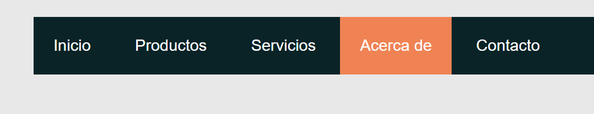
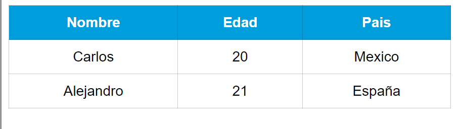
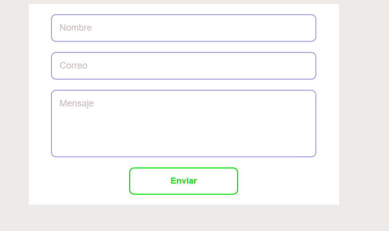
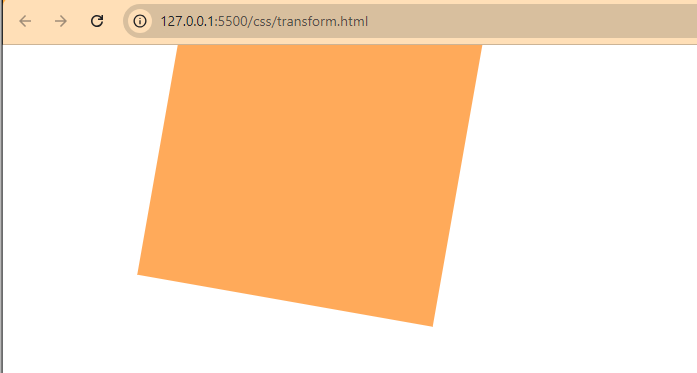
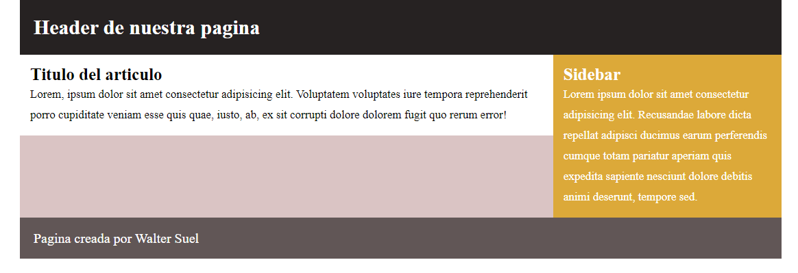

# SECCION 4: CSS

# 34. Introduccion

# 35. Nuestros primeros estilos CSS

```html
<!DOCTYPE html>
<html lang="es">
<head>
    <meta charset="UTF-8">
    <meta name="viewport" content="width=device-width, initial-scale=1.0">
    <title>Mi primera pagina web con estilos CSS</title>

    <!-- Primera forma -->
    <link rel="stylesheet" href="estilos.css">

    <!-- Segunda Forma -->
    <!-- <style>
        body {
            color: red;
        }
    </style> -->
</head>
<body>
    <h1>Hola Mundo</h1>
    <p>
        Lorem ipsum, dolor sit amet consectetur adipisicing elit. Quidem veritatis, et harum magnam odit asperiores sequi doloribus, saepe provident placeat iusto? Quis facilis optio, quidem magnam fugit quaerat voluptas facere.
    </p>
</body>
</html>
```

```css
/*
Estructura de una regla CSS
body <---> Selector, al elemento al que le queremos aplicar los efectos
color <---> Propiedad, efecto o cambio que le queremos dar al o los elementos
blue: <---> Valor que le daremos a la propiedad
*/

body {
    color: blue;
}
```

# 36. Selectores (Parte 1)

```html
<!DOCTYPE html>
<html lang="en">
<head>
    <meta charset="UTF-8">
    <meta name="viewport" content="width=device-width, initial-scale=1.0">
    <title>Selectores</title>
    <link rel="stylesheet" href="selectores.css">
</head>
<body>
    <h1>Hola mundo</h1>
    <p>Lorem ipsum dolor sit, amet consectetur adipisicing elit. Sequi repellendus reiciendis.</p>
    <div>
        <p>Soy un parrafo <a href="#">dentro</a> de un div</p>
    </div>
    <div>
        <article>
            <p>Soy un parrafo dentro de un div y un article</p>
        </article>
    </div>
    <a href="#">Soy un enlace</a>
    <a href="#">Soy otro enlace</a>
</body>
</html>
```

```css
/* Selector Universal
* {
    color: red;    
} */

h1 {
    color: blue;
}

/* h1, h2, h3 {
    color: blue;
} */

div p {
    font-size: 20px;
    color: black;
}

div article p {
    font-size: 30px;
    color: green;
}

p a {
    font-size: 25;
    color: pink;
}

/* Mas especifico
div p a {
    font-size: 25;
    color: pink;
} */
```


# 37. Selectores (Parte 2)

```html
<!DOCTYPE html>
<html lang="en">
<head>
    <meta charset="UTF-8">
    <meta name="viewport" content="width=device-width, initial-scale=1.0">
    <title>Selectores</title>
    <link rel="stylesheet" href="selectores.css">
</head>
<body>
    <h1>Hola mundo</h1>
    <p>Lorem ipsum dolor sit, amet consectetur adipisicing elit. Sequi repellendus reiciendis.</p>
    <div>
        <p>Soy un parrafo <a href="#">dentro</a> de un div</p>
    </div>
    <div>
        <article>
            <p>Soy un parrafo dentro de un div y un article</p>
        </article>
    </div>
    <a href="#" class="grande">Soy un enlace</a>
    <a href="#" class="grande" id="rojo">Soy otro enlace</a>
</body>
</html>
```

```css
.grande {
    font-size: 28px;
}

/* Los id no se suelen usar para estilos, lo recomendable solo usar class */
#rojo {
    color: red;
}

/* Se puede hacer diferentes combinaciones
.main article p {

} */
```


# 38. Selectores Avanzados

```html
<!DOCTYPE html>
<html lang="en">
<head>
    <meta charset="UTF-8">
    <meta name="viewport" content="width=device-width, initial-scale=1.0">
    <title>Selectores Avanzados</title>
    <link rel="stylesheet" href="selectoresAvanzados.css">
</head>
<body>
    <p>Soy un parrafo</p>
    <div>
        <article>
            <p>Soy un parrafo dentro de un article</p>
        </article>
    </div>
    <div>
        <p>
            Soy un parrafo directamente dentro de un div
        </p>
    </div>
    <article>
        Lorem ipsum dolor sit amet consectetur, adipisicing elit.
    </article>
</body>
</html>
```

```css
/* Seleccionamos solo los parrafos que sean hijos directos de un div */
div > p {
    font-size: 25px;
    color: red;
}

/* 
input[type] {

}

input [type="text"] {

} 
*/

/* Herencia */
body {
    font-size: 16px;
    color: blue;
}

article {
    font-size: 20px;
    color: brown;
}
```


# 39. Fondos

Recursos:

- https://html-color-codes.info/codigos-de-colores-hexadecimales/
- https://unsplash.com/es/fotos/cordillera-con-hierba-verde-ladera-Lzx4J_Pb3sk
- https://www.toptal.com/designers/subtlepatterns/

```html
<!DOCTYPE html>
<html lang="es">
<head>
    <meta charset="UTF-8">
    <meta name="viewport" content="width=device-width, initial-scale=1.0">
    <title>Fondos</title>
    <link rel="stylesheet" href="fondo.css">
</head>
<body>
    <!-- <article>
        <p>Lorem ipsum dolor sit, amet consectetur adipisicing elit. Magni, beatae? Amet, nihil laboriosam eius est distinctio nesciunt alias nemo autem totam doloremque excepturi, molestias dolorum dignissimos aliquam enim, odit similique?</p>
        <br><br><br><br>
        <p>Lorem ipsum dolor sit, amet consectetur adipisicing elit. Magni, beatae? Amet, nihil laboriosam eius est distinctio nesciunt alias nemo autem totam doloremque excepturi, molestias dolorum dignissimos aliquam enim, odit similique?</p>
        <br><br><br><br>
        <p>Lorem ipsum dolor sit, amet consectetur adipisicing elit. Magni, beatae? Amet, nihil laboriosam eius est distinctio nesciunt alias nemo autem totam doloremque excepturi, molestias dolorum dignissimos aliquam enim, odit similique?</p>
        <br><br><br><br>
        <p>Lorem ipsum dolor sit, amet consectetur adipisicing elit. Magni, beatae? Amet, nihil laboriosam eius est distinctio nesciunt alias nemo autem totam doloremque excepturi, molestias dolorum dignissimos aliquam enim, odit similique?</p>
        <br><br><br><br>
        <p>Lorem ipsum dolor sit, amet consectetur adipisicing elit. Magni, beatae? Amet, nihil laboriosam eius est distinctio nesciunt alias nemo autem totam doloremque excepturi, molestias dolorum dignissimos aliquam enim, odit similique?</p>
        <br><br><br><br>
        <p>Lorem ipsum dolor sit, amet consectetur adipisicing elit. Magni, beatae? Amet, nihil laboriosam eius est distinctio nesciunt alias nemo autem totam doloremque excepturi, molestias dolorum dignissimos aliquam enim, odit similique?</p>
        <br><br><br><br>
        <p>Lorem ipsum dolor sit, amet consectetur adipisicing elit. Magni, beatae? Amet, nihil laboriosam eius est distinctio nesciunt alias nemo autem totam doloremque excepturi, molestias dolorum dignissimos aliquam enim, odit similique?</p>
        <br><br><br><br>
        <p>Lorem ipsum dolor sit, amet consectetur adipisicing elit. Magni, beatae? Amet, nihil laboriosam eius est distinctio nesciunt alias nemo autem totam doloremque excepturi, molestias dolorum dignissimos aliquam enim, odit similique?</p>
        <br><br><br><br>
        <p>Lorem ipsum dolor sit, amet consectetur adipisicing elit. Magni, beatae? Amet, nihil laboriosam eius est distinctio nesciunt alias nemo autem totam doloremque excepturi, molestias dolorum dignissimos aliquam enim, odit similique?</p>
    </article> -->
    <div class="fondo"></div>
</body>
</html>
```

```css
/* body {
    background: #5F04B4;
} */

/* body {
    background: url(img/paisaje.jpg);
    background-size: cover;
    background-repeat: no-repeat;
    background-attachment: fixed;
    background-position: center;
} */

/* Otra forma
body {
    background: url(img/paisaje.jpg) no-repeat fixed center;
    background-size: cover;
} */

/* .fondo {
    width: 600px;
    height: 600px;
    background: url(img/paisaje.jpg) #000;
    background-repeat: no-repeat;
    background-size: 50%;
} */

body {
    background: url(img/moroccan-flower.png);
    background-repeat: repeat;
    background-attachment: scroll;
}
```

# 40. Gradientes

Ya no se usan muchos gradientes en la actualidad

Recurso: https://www.colorzilla.com/gradient-editor/

```html
<!DOCTYPE html>
<html lang="es">
<head>
    <meta charset="UTF-8">
    <meta name="viewport" content="width=device-width, initial-scale=1.0">
    <title>Gradiente</title>
    <link rel="stylesheet" href="gradientes.css">
</head>
<body>
    <div class="fondo"></div>
</body>
</html>
```

```css
.fondo {
    width: 500px;
    height: 300px;

    /* Gradiente generado por la pagina de recurso */
    background: linear-gradient(to bottom, rgba(255, 183, 107, 1) 0%, rgba(255, 167, 61, 1) 50%, rgba(255, 124, 0, 1) 51%, rgba(255, 127, 4, 1) 100%);
}
```

# 41. Enlaces

```html
<!DOCTYPE html>
<html lang="en">
<head>
    <meta charset="UTF-8">
    <meta name="viewport" content="width=device-width, initial-scale=1.0">
    <title>Enlaces</title>
    <link rel="stylesheet" href="enlaces.css">
</head>
<body>
    <a href="#">Enlace</a>
    <a href="https://ww.google.com">Google</a>
</body>
</html>
```

```css
a {
    font-size: 20px;
    text-decoration: none;
}


/* 
El pseudo-clase :hover en CSS es una herramienta poderosa para mejorar la interactividad y la experiencia de usuario en una página web. Se usa para aplicar estilos específicos a un elemento cuando el usuario coloca el cursor sobre él (hover), sin hacer clic. Se aplica directamente a un selector en CSS, y los estilos definidos dentro de :hover se activan cuando el cursor se coloca sobre el elemento correspondiente.

*/
a:hover {
    background: #f9a03f;
    color: #fff;
}

/* Enlace sin visitar */
a:link {
    text-decoration: none;
}

/* Enlace visitado */
a:visited {
    color: aqua;
}

/* Estado del enlace mientras se esta haciendo click */
a:active {
    text-decoration: underline;
}
```

# 42. Texto y Tipografia

```html
<!DOCTYPE html>
<html lang="en">

<head>
    <meta charset="UTF-8">
    <meta name="viewport" content="width=device-width, initial-scale=1.0">
    <title>Tipografia</title>
    <link rel="stylesheet" href="tipografia.css">
</head>

<body>
    <p>
        Lorem ipsum dolor sit amet consectetur, adipisicing elit. Aliquid enim ratione, voluptatibus libero doloribus
        exercitationem quas nam, impedit ullam soluta sed labore quo magni atque aspernatur laboriosam facere maxime
        dicta!
        <br><br>
        Lorem ipsum dolor sit amet consectetur, adipisicing elit. Aliquid enim ratione, voluptatibus libero doloribus
        exercitationem quas nam, impedit ullam soluta sed labore quo magni atque aspernatur laboriosam facere maxime
        dicta!
        <br><br>
        Lorem ipsum dolor sit amet consectetur, adipisicing elit. Aliquid enim ratione, voluptatibus libero doloribus
        exercitationem quas nam, impedit ullam soluta sed labore quo magni atque aspernatur laboriosam facere maxime
        dicta!
        <br><br>
        Lorem ipsum dolor sit amet consectetur, adipisicing elit. Aliquid enim ratione, voluptatibus libero doloribus
        exercitationem quas nam, impedit ullam soluta sed labore quo magni atque aspernatur laboriosam facere maxime
        dicta!
        <br><br>
    </p>
    <h1>Encabezado H1</h1>
    <h2>Encabezado H2</h2>
    <h3>Encabezado H3</h3>
    <h4>Encabezado H4</h4>
    <h5>Encabezado H5</h5>
    <h6>Encabezado H6</h6>
</body>

</html>
```

```css
body {
    font-family: Arial, Helvetica, sans-serif;
}

p {
    text-align: justify;
    text-transform: capitalize;
    letter-spacing: 5px;
    line-height: 30px;
}

h1 {
    font-family: 'Times New Roman', Times, serif;
    font-size: 28px;
    font-style: italic;
    font-weight: normal;
    color: #4281ed;
    text-align: left;
    text-decoration: underline;
    text-transform: uppercase;
}
```


# 43. Unidades de medida

```html
<!DOCTYPE html>
<html lang="en">

<head>
    <meta charset="UTF-8">
    <meta name="viewport" content="width=device-width, initial-scale=1.0">
    <title>Unidades de Medida</title>
    <link rel="stylesheet" href="unidadesMedida.css">
</head>

<body>
    <p>
        Lorem ipsum dolor sit amet consectetur adipisicing elit. Quis, vel maxime? Excepturi officia sapiente
        accusantium officiis delectus sint. Accusamus officiis repudiandae blanditiis fugit modi eius sunt, nulla quo
        nemo saepe.
    </p>
    <p>
        Lorem ipsum dolor sit amet consectetur adipisicing elit. Quis, vel maxime? Excepturi officia sapiente
        accusantium officiis delectus sint. Accusamus officiis repudiandae blanditiis fugit modi eius sunt, nulla quo
        nemo saepe.
    </p>
    <div class="contenedor-padre">
        <div class="hijo">
            Lorem ipsum dolor sit.
        </div>
    </div>

</body>

</html>
```

```css
body {
    font-size: 16px;
}

/* p {
    font-size: 30px;
} */

p {
    font-size: 1.5em;
}

.contenedor-padre {
    font-size: 20px;
}

.hijo {
    width: 10rem;
    height: 10rem;
    background: #000;
    color: white;
}

/* 
em: La unidad em es relativa al tamaño de fuente del elemento padre inmediato. Esto significa que su valor cambia dependiendo del contexto en el que se utiliza. Se utiliza a menudo para establecer tamaños de fuente, márgenes, paddings, y otros aspectos de diseño de manera que escalen de acuerdo con el tamaño de la fuente del elemento padre. Si el tamaño de fuente del elemento padre es de 16px, entonces 1em será igual a 16px

rem: La unidad rem es relativa al tamaño de la fuente de la raíz del documento (específicamente el elemento <html>). Es más predecible y consistente que em porque no se ve afectada por la cascada de estilos de los elementos padres. Se utiliza para mantener consistencia en el diseño, ya que siempre se basa en el tamaño de fuente raíz del documento. Esto es especialmente útil en diseños responsivos y cuando se necesita evitar el "efecto cascada" de em. Si el tamaño de fuente del elemento <html> es de 16px (el valor por defecto en la mayoría de los navegadores), entonces 1rem será igual a 16px.
*/
```


# 44. Unidades de color

Recursos: 
- https://coolors.co/
- https://html-color-codes.info/codigos-de-colores-hexadecimales/

```html
<!DOCTYPE html>
<html lang="en">
<head>
    <meta charset="UTF-8">
    <meta name="viewport" content="width=device-width, initial-scale=1.0">
    <title>Unidades de color</title>
    <link rel="stylesheet" href="unidadesColor.css">
</head>
<body>
    <div class="caja"></div>
</body>
</html>
```

```css
/* 
Colores por nombre: CSS incluye una lista de colores predeterminados que pueden ser referenciados por nombre. Estos nombres representan colores comunes como red, blue, green, etc.

Hexadecimal: Los colores hexadecimales se especifican con un signo # seguido de seis dígitos que representan los valores de los componentes rojo (R), verde (G) y azul (B) en formato hexadecimal.

RGB: Especifica los colores mediante la combinación de los valores de los componentes rojo, verde y azul en formato decimal. Formato: rgb(255, 87, 51), donde cada valor va de 0 a 255.

RGBA: Es una extensión de RGB que añade un cuarto componente, alpha, para controlar la opacidad (transparencia) del color. Formato: rgba(255, 87, 51, 0.5), donde el valor de alpha varía de 0 (totalmente transparente) a 1 (totalmente opaco).

*/

/* .caja {
    width: 200px;
    height: 200px;
    background: #000;
} */

/* .caja {
    width: 200px;
    height: 200px;
    background: rgb(215, 38, 61);
} */

/* .caja {
    width: 200px;
    height: 200px;
    background: #328BF0;
} */

.caja {
    width: 200px;
    height: 200px;
    background: rgba(215, 38, 61, 0.2);
}
```

# 45. Modelo de caja

```html
<!DOCTYPE html>
<html lang="en">
<head>
    <meta charset="UTF-8">
    <meta name="viewport" content="width=device-width, initial-scale=1.0">
    <title>Modelo de Caja</title>
    <link rel="stylesheet" href="modeloCaja.css">
</head>
<body>
    <div class="caja">
        <p>
            Lorem ipsum dolor sit amet consectetur adipisicing elit. Ex quos sequi placeat aliquam dolorem cupiditate nostrum officia!.
        </p>
    </div>
    <div class="caja">
        <p>
            Lorem ipsum dolor sit amet consectetur adipisicing elit. Ex quos sequi placeat aliquam dolorem cupiditate nostrum officia!. Ex quos sequi placeat aliquam dolorem cupiditate nostrum officia!. Ex quos sequi placeat aliquam dolorem cupiditate nostrum officia!. cupiditate nostrum officia!
        </p>
    </div>
</body>
</html>
```

```css
* {
    padding: 0;
    margin: 0;
}

body {
    font-family: Arial, Helvetica, sans-serif;
    line-height: 22px;
}

.caja {
    background: #0353a4;
    width: 200px;
    /* height: 200px; */
    margin: 20px;
    padding: 20px;
    /* margin-top: 20px;
    margin-right: 10px;
    margin-bottom: 5px;
    margin-left: 0px; */
    border: 8px solid #000;
}

.caja p{
    background: #eee5e9;
}
```


# 46. Tipo de elementos

```html
<!DOCTYPE html>
<html lang="en">
<head>
    <meta charset="UTF-8">
    <meta name="viewport" content="width=device-width, initial-scale=1.0">
    <title>Tipos de Elementos</title>
    <link rel="stylesheet" href="tiposElementos.css">
</head>
<body>
    <h1>Hola, soy un encabezado</h1>
    <p>Yo soy un parrafo <a href="#">Soy un enlace dentro de un parrafo</a></p>
    <div>Yo soy un contenedor div</div> 
    <a href="#">Soy un enlace</a>
    <a href="#">Soy otro enlace</a>
</body>
</html>
```

```css
/* 
Elementos en bloque: Los elementos en bloque son aquellos que ocupan todo el ancho disponible de su contenedor, lo que significa que, por defecto, se extienden a lo largo de la página (de izquierda a derecha en un documento de flujo normal). Comienzan en una nueva línea y empujan el contenido siguiente hacia abajo.
Ejemplos comunes: div, p, h1,h2,h3,ul,ol,li,section,article,header,footer

Elementos en línea: Los elementos en línea solo ocupan el espacio necesario para su contenido y no fuerzan una nueva línea después de ellos. Se alinean uno al lado del otro horizontalmente si hay espacio disponible.
Ejemplos comunes: span, a, img, strong, br, button, textarea
 */

body {
    background: #f2f2f2;
    font-family: Arial, Helvetica, sans-serif;
}

h1, p, div {
    background: #ccc;
    padding: 10px;
    width: 500px;
    display: inline-block;
}

/* a {
    color: #fff;
    background: #000;
    padding: 10px;
} */

/* Por defecto a los elementos de tipo linea no se le pueden agregar un padding, width, height, pero se pueden convertir, haciendo lo siguiente: */

/* El valor inline-block de la propiedad CSS display es una combinación útil que permite a un elemento comportarse como un elemento en línea pero con algunas características de los elementos en bloque. Este comportamiento híbrido es particularmente valioso cuando se desea que un elemento mantenga ciertas propiedades de los elementos en línea y de los elementos en bloque. */

a {
    color: #fff;
    background: #000;
    padding: 10px;
    display: inline-block;
    height: 50px;
}
```


# 47. [PRACTICA] Diseñando unos botones con CSS

```html
<!DOCTYPE html>
<html lang="en">

<head>
    <meta charset="UTF-8">
    <meta name="viewport" content="width=device-width, initial-scale=1.0">
    <title>Botones</title>
    <link rel="stylesheet" href="botones.css">
</head>

<body>
    <div>
        <a href="#" class="btn">Boton Standar</a>
    </div>

    <div>
        <a href="#" class="btn small">Pequeño</a>
        <a href="#" class="btn medium azul">Mediano</a>
        <a href="#" class="btn big verde">Grande</a>
        <a href="#" class="btn extra-big naranja">Extra Grande</a>
    </div>

    <div>
        <a href="#" class="btn small border-radius">Pequeño</a>
        <a href="#" class="btn medium azul border-radius">Mediano</a>
        <a href="#" class="btn big verde border-radius">Grande</a>
        <a href="#" class="btn extra-big naranja border-radius">Extra Grande</a>
    </div>


</body>

</html>
```

```css
body {
    background: #f2f2f2;
    font-family: Arial, Helvetica, sans-serif;
}

div {
    margin: 20px 0;
}

.btn {
    background: #201C21;
    color: #fff;
    font-size: 16px;
    text-decoration: none;
    padding: 15px 20px;
    display: inline-block;
    margin: 0px 10px;
}

.btn:hover {
    opacity: 0.8;
}

/* TAMAÑOS */
.small {
    font-size: 14px;
    padding: 10px 15px;
}

.medium {
    font-size: 16px;
    padding: 15px 20px;
}

.big {
    font-size: 18px;
    padding: 20px 25px;
}

.extra-big {
    font-size: 20px;
    padding: 25px 30px;
}

/* COLORES */
.azul {
    background: blue;
}

.verde {
    background: green;
}

.naranja {
    background: orange;
}

/* EFECTOS */
.border-radius {
    border-radius: 50px;
}
```


# 48. Posicionamiento de cajas

```html
<!DOCTYPE html>
<html lang="en">

<head>
    <meta charset="UTF-8">
    <meta name="viewport" content="width=device-width, initial-scale=1.0">
    <title>Posicionamiento de Cajas</title>
    <link rel="stylesheet" href="posicionamiento.css">
</head>

<body>
    <div class="caja"></div>
    <!-- <div class="cajaPadre"> -->
        <div class="caja posicionada"></div>
    <!-- </div> -->
    <div class="caja"></div>
    <div class="caja"></div>
    <div class="caja"></div>
    <div class="caja"></div>
    <div class="caja"></div>
    <div class="caja"></div>
</body>

</html>
```

```css
* {
    padding: 0;
    margin: 0;
}

body {
    background: #f2f2f2;
}

.caja {
    width: 200px;
    height: 200px;
    background: #0e6ba8;
    margin: 20px;
    float: left;
}

/* .cajaPadre {
    margin: 20px;
    background: #2e294e;
    width: 500px;
    height: 500px;
    position: relative;
} */

/* .posicionada {
    background: #6695e8;
    position: relative;
    left: 200px;
    top: 50px;
} */

/* .posicionada {
    background: #6695e8;
    position: absolute;
    bottom: 200px;
    left: 200px;
} */

/* .posicionada {
    background: #6695e8;
    position: absolute;
    bottom: 0%;
    right: 0%;
} */

.posicionada {
    background: #6695e8;

}

/* 

En CSS, la propiedad position es fundamental para controlar el posicionamiento de los elementos HTML en una página web. Permite determinar cómo se debe colocar un elemento en el documento y cómo interactúa con otros elementos en términos de flujo de documento y superposición. Aquí están los valores que puede tomar y cómo funcionan:

static: Es el valor por defecto para todos los elementos. El elemento se posiciona según el flujo normal del documento, sin respetar las propiedades top, bottom, left, y right.

relative: El elemento se posiciona relativo a su posición original en el flujo normal del documento. Permite mover el elemento utilizando top, bottom, left, y right, pero sin sacarlo de su flujo normal, lo que significa que aún ocupa espacio en el documento como si estuviera en posición estática.

absolute: El elemento se saca del flujo normal del documento y no afecta la posición de otros elementos (es decir, no ocupa espacio físico en la página). Utiliza top, bottom, left, y right para moverse respecto a ese contenedor.

fixed: Similar a absolute, pero siempre se posiciona en relación con la ventana del navegador. No se mueve al hacer scroll por la página. Ideal para elementos como barras de navegación que deben permanecer visibles todo el tiempo.

float: La propiedad float en CSS se utiliza para colocar un elemento a la izquierda o a la derecha de su contenedor, permitiendo que el texto y los elementos en línea fluyan a su alrededor. Los valores más comunes para float son left, right y none.
*/
```

# 49.Posicionamiento flotante

```html
<!DOCTYPE html>
<html lang="en">
<head>
    <meta charset="UTF-8">
    <meta name="viewport" content="width=device-width, initial-scale=1.0">
    <title>Posicionamiento flotante</title>
    <link rel="stylesheet" href="float.css">
</head>
<body>
    <div class="cajaPadre">
        <div class="caja uno">1</div>
        <div class="caja dos">2</div>

        <!-- <div class="clear"></div> -->
    </div>

    <article class="articulo">
        
        <p>Lorem ipsum dolor, sit amet consectetur adipisicing elit. Architecto adipisci natus quam ipsa impedit dolores enim aut sapiente explicabo aliquid, beatae id numquam tenetur recusandae hic debitis earum laborum velit.</p>
        <p>Lorem ipsum dolor, sit amet consectetur adipisicing elit. Architecto adipisci natus quam ipsa impedit dolores enim aut sapiente explicabo aliquid, beatae id numquam tenetur recusandae hic debitis earum laborum velit.</p>
        <p>Lorem ipsum dolor, sit amet consectetur adipisicing elit. Architecto adipisci natus quam ipsa impedit dolores enim aut sapiente explicabo aliquid, beatae id numquam tenetur recusandae hic debitis earum laborum velit.</p>
        <p>Lorem ipsum dolor, sit amet consectetur adipisicing elit. Architecto adipisci natus quam ipsa impedit dolores enim aut sapiente explicabo aliquid, beatae id numquam tenetur recusandae hic debitis earum laborum velit.</p>
    </article>
</body>
</html>
```

```css
* {
    padding: 0;
    margin: 0;
}

body {
    background: #f2f2f2;
    font-family: Arial, Helvetica, sans-serif;
}

.cajaPadre {
    background: #2e294a;
    width: 700px;
    overflow: hidden;
}

.caja {
    width: 200px;
    height: 200px;
    color: #fff;
    font-size: 38px;
    background: #0e6ba8;
    margin: 20px;
}

.uno {
    float: left;
}

.dos {
    float: right;
}

/* No es recomendable usar este metodo */
/* .clear {
    clear: both;
} */


/* Lo recomendable es usar overflow:hidden*/


.articulo {
    width: 800px;
    background: #ccc;
    overflow: hidden;
}

img {
    float: left;
}
```

# 50. Visualizacion

```html
<!DOCTYPE html>
<html lang="en">
<head>
    <meta charset="UTF-8">
    <meta name="viewport" content="width=device-width, initial-scale=1.0">
    <title>Visualizacion</title>
    <link rel="stylesheet" href="visualizacion.css">
</head>
<body>
    <div class="caja">
        <p>Lorem ipsum dolor sit amet consectetur adipisicing elit. Modi fugiat velit, eum nesciunt necessitatibus sed voluptas. Quasi perferendis libero rerum aperiam tempora. Cum blanditiis, ullam hic amet architecto dignissimos suscipit? consectetur adipisicing elit. Quos provident repudiandae ea laudantium, sequi sit optio, perspiciatis sunt illum voluptate temporibus dolor repellat earum quibusdam, tempore rem nesciunt recusandae doloremque.</p>
    </div>

    <a href="#">Enlace</a>
    <a href="#">Enlace</a>

    <div class="contenedor">
        <a href="#" class="izquierda">Izquierda</a>
        <a href="#" class="derecha">Derecha</a>
    </div>

    <p>Lorem ipsum dolor sit amet, consectetur adipisicing elit. Quos provident repudiandae ea laudantium, sequi sit optio, perspiciatis sunt illum voluptate temporibus dolor repellat earum quibusdam, tempore rem nesciunt recusandae doloremque, </p>

    <div class="contenedor2">
        <div class="caja azul"></div>
        <div class="caja gris"></div>
    </div>
</body>
</html>
```

```css
body {
    font-family: Arial, Helvetica, sans-serif;
    background-color: #f2f2f2;
}

div, a {
    background: #ccc;
}

a {
    /* display: block; */
    /* display: none; */
    /* visibility: hidden; */
    background: #246eb9;
    color: white;
    padding: 20px;
    text-decoration: none;
    display: inline-block;
}

.caja {
    color: #000;
    background: #4fb560;
    margin: 20px 0;
    width: 200px;
    height: 200px;
    overflow: auto;
}

.contenedor {
    width: 600px;
    background-color: #ccc;
    margin: 20px 0px;
    overflow: hidden;
}

.izquierda {
    float: left;
}

.derecha {
    float: right;
}

.contenedor2 .caja{
    width: 150px;
    height: 150px;
    position: relative;
}

.azul {
    background: blue;
    z-index: 1;
}

.gris {
    background: gray;
    left: 50px;
    bottom: 80px;
    z-index: 2;
}

/* 
La propiedad display en CSS es crucial para controlar el comportamiento de caja de los elementos en la página web, es decir, cómo se muestran en relación con ellos mismos y sus elementos hermanos. Es uno de los aspectos más fundamentales para diseñar y manejar layouts en CSS. Aquí te detallo los valores más comunes y sus efectos:

block: Los elementos block ocupan todo el ancho disponible de su contenedor, independientemente de su contenido, y siempre comienzan en una nueva línea.

inline: Los elementos inline no comienzan en una nueva línea y solo ocupan tanto ancho como su contenido lo requiere.

inline-block: Combina comportamientos de inline y block: el elemento no rompe la línea pero permite definir ancho y alto como un elemento block.

none: El elemento no se muestra y se elimina del flujo del documento, como si no existiera. No ocupa espacio y los elementos después de él se mueven como si el elemento none nunca hubiera estado ahí.
*/

/* 

La propiedad visibility: hidden; en CSS se utiliza para ocultar un elemento en una página web, pero a diferencia de display: none;, el elemento oculto sigue ocupando espacio en el diseño (layout) de la página.
*/

/* 
La propiedad overflow: hidden; en CSS se utiliza para controlar lo que sucede cuando el contenido de un elemento es más grande que el área de ese elemento. Específicamente, overflow: hidden; oculta cualquier contenido que se desborde fuera del área asignada del contenedor.

La propiedad overflow: auto; en CSS se utiliza para gestionar el contenido desbordado de un contenedor. Cuando se aplica, esta propiedad agrega automáticamente barras de desplazamiento (scrollbars) si el contenido de un elemento es más grande que su contenedor.
*/
 /* 
 El z-index es una propiedad de CSS que controla el orden de apilamiento de los elementos en una página web, determinando qué elementos se colocan delante o detrás de otros. Es especialmente útil cuando tienes elementos que se superponen y necesitas controlar cuál debe aparecer encima de los demás. El z-index solo funciona en elementos que tienen una posición establecida como relative, absolute, fixed, o sticky. Si un elemento tiene position: static (la posición por defecto), no responde a z-index. El valor de z-index puede ser un número entero (positivo o negativo) o auto. Los valores más altos de z-index se apilan sobre los más bajos, lo que significa que un elemento con un z-index de 10 se apilará encima de uno con un z-index de 5.
 */

```

# 51. [PRACTICA] Galeria de imagenes

```html
<!DOCTYPE html>
<html lang="en">
<head>
    <meta charset="UTF-8">
    <meta name="viewport" content="width=device-width, initial-scale=1.0">
    <title>Galeria de imagenes</title>
    <link rel="stylesheet" href="imagenes.css">
</head>
<body>
    <div class="galeria">
        
        
        
        
        
        
        
        
    </div>
</body>
</html>
```

```css
* {
    margin: 0;
    padding: 0;
}
body {
    background-color: #000;
}
.galeria {
    width: 100%;
}

.galeria img {
    vertical-align: top;
    width: 400px;
    opacity: 0.5;
    margin: 20px;
    border: #484848 solid 1px;
    padding: 5px;
}

img:hover {
    border: 1px solid #fff;
    opacity: 1;
}
```

# 52. Sombras

```html
<!DOCTYPE html>
<html lang="en">
<head>
    <meta charset="UTF-8">
    <meta name="viewport" content="width=device-width, initial-scale=1.0">
    <title>Sombras</title>
    <link rel="stylesheet" href="sombras.css">
</head>
<body>
    <h1 class="texto"> Hola Mundo</h1>
    <div class="caja"></div>
</body>
</html>
```

```css
.texto {
    /* text-shadow: 0px 0px 10px #000; */
    color: #fff;
    text-shadow: 2px 0px 10px blue;
}

.caja {
    width: 200px;
    height: 200px;
    background: #f79256;
    box-shadow: 0px 5px 10px rgba(0, 0, 0, 0.5);
}
```

# 53. Bordes y bordes redondeados

```html
<!DOCTYPE html>
<html lang="en">
<head>
    <meta charset="UTF-8">
    <meta name="viewport" content="width=device-width, initial-scale=1.0">
    <title>Bordes</title>
    <link rel="stylesheet" href="bordes.css">
</head>
<body>
    <div class="caja1"></div>
    <div class="caja2"></div>
    <div class="caja3"></div>
    <div class="caja4"></div>
</body>
</html>
```

```css
div {
    background: #226fc1;
    width: 200px;
    height: 200px;
    margin: 20px;
    display: inline-block;
}

.caja1 {
    border: 7px solid #000;
    border-radius: 20px;
}

.caja2 {
    border: 7px dotted #000;
    border-radius: 0px 10px 30px 50px;
}

.caja3 {
    border: 7px dashed #000;
    border-radius: 0px 10px 0 10px;
}

.caja4 {
    /* border: 7px double #000; */
    /* border: 7px groove #000; */
    /* border: 7px ridge #000; */
    /* border: 7px inset #000; */
    border: 7px outset #000;
    border-radius: 100%;
}
```

# 54. Pseudo-clases

```html
<!DOCTYPE html>
<html lang="en">

<head>
    <meta charset="UTF-8">
    <meta name="viewport" content="width=device-width, initial-scale=1.0">
    <title>Pseudo-Clase</title>
    <link rel="stylesheet" href="pseudoclase.css">
</head>

<body>
    <a href="https://www.falconmasters.com" class="enlace">Enlace</a>
    <a href="https://www.google.com">Google</a>

    <div>
        <p>
            Lorem ipsum dolor, sit amet consectetur adipisicing elit. Consectetur ut neque, ea animi repellendus nostrum rem quae soluta exercitationem eius hic ducimus sequi modi omnis dolor fugiat illo atque molestiae?
        </p>
        <p>
            Lorem ipsum dolor, sit amet consectetur adipisicing elit. Consectetur ut neque, ea animi repellendus nostrum rem quae soluta exercitationem eius hic ducimus sequi modi omnis dolor fugiat illo atque molestiae?
        </p>
        <p>
            Lorem ipsum dolor, sit amet consectetur adipisicing elit. Consectetur ut neque, ea animi repellendus nostrum rem quae soluta exercitationem eius hic ducimus sequi modi omnis dolor fugiat illo atque molestiae?
        </p>
    </div>
</body>

</html>
```

```css
body {
    font-family: Arial, Helvetica, sans-serif;
}

a {
    background: #4357ad;
    padding: 20px 30px;
    display: inline-block;
    color: #fff;
    font-size: 20px;
}

a:hover {
    background: #009ddc;
    padding: 25px 35px;
    border: 3px solid #000;
}

a:active {
    background: #000;
}

/* a:visited {
    background: #ccc;
} */

div {
    width: 500px;
}

div p:hover {
    background-color: #000;
    color: #fff;
}

div p::first-line {
    background: #3a3a3a;
    color: #fff;
    font-size: 20px;
}

div p:nth-child(2) {
    background: #009ddc;
    color: #fff;
    padding: 10px;
}
```

# 55. Pseudo-elementos

```html
<!DOCTYPE html>
<html lang="en">
<head>
    <meta charset="UTF-8">
    <meta name="viewport" content="width=device-width, initial-scale=1.0">
    <title>Pseudo-elementos</title>
    <link rel="stylesheet" href="pseudoelementos.css">
</head>
<body>
    <p>
        Lorem ipsum, dolor sit amet consectetur adipisicing elit. Assumenda obcaecati nulla explicabo tempora maxime tempore non quibusdam reiciendis ex. Minima reprehenderit molestias facilis doloremque quidem ab temporibus iusto qui culpa?
    </p>
    <p>
        Lorem ipsum dolor sit amet consectetur adipisicing elit. Impedit laudantium ea soluta ipsam. Labore vero consequatur laborum mollitia neque laboriosam aliquid iure praesentium dolore libero delectus debitis, dolorum, unde facilis.
    </p>

    <div class="caja">Contenido de la caja</div>
</body>
</html>
```

```css
p::first-letter {
    font-size: 40px;
    font-weight: bold;
}

p::first-line {
    background: #cf5c36;
    line-height: 40px;
}

*::selection {
    background: #f9a03f;
    color: #fff;
}

.caja {
    background: #f9a03f;
    height: 150px;
    width: 150px;
}

.caja::before {
    content: 'Contenido Antes de la caja';
    display: block;
    background: #3a3a3a;
    color: #fff;
}

.caja::after {
    content: '';
    width: 50px;
    height: 50px;
    display: block;
    background: #000;
    position: relative;
    left: 120px;
}

/* 
El pseudoelemento ::selection en CSS se utiliza para aplicar estilos a la parte de un documento que el usuario selecciona, generalmente con el cursor del mouse o el teclado. Esto permite personalizar la apariencia del texto u otros elementos cuando son resaltados o seleccionados.
*/

/* 

Los pseudoelementos ::before y ::after en CSS se utilizan para insertar contenido antes o después del contenido real de un elemento, sin necesidad de modificar el HTML. Estos pseudoelementos son muy útiles para agregar decoraciones, iconos, o cualquier otro contenido adicional que se necesite alrededor de un elemento.

before: Inserta contenido antes del contenido real de un elemento.
after: Inserta contenido después del contenido real de un elemento.

Para que ::before y ::after funcionen, es necesario definir la propiedad content. Esta propiedad especifica qué contenido se insertará y puede incluir texto, imágenes (a través de url()), o estar vacía.
*/
```


# 56. Listas

```html
<!DOCTYPE html>
<html lang="en">
<head>
    <meta charset="UTF-8">
    <meta name="viewport" content="width=device-width, initial-scale=1.0">
    <title>Listas</title>
    <link rel="stylesheet" href="listas.css">
</head>
<body>
    <ul class="menu">
        <li><a href="#">Elemento #1</a></li>
        <li><a href="#">Elemento #2</a></li>
        <li><a href="#">Elemento #3</a></li>
        <li><a href="#">Elemento #4</a></li>
        <li><a href="#">Elemento #5</a></li>
    </ul>

    <ol>
        <li>Elemento #1</li>
        <li>Elemento #2</li>
        <li>Elemento #3</li>
        <li>Elemento #4</li>
        <li>Elemento #5</li>
    </ol>
</body>
</html>
```

```css
body {
    font-family: Arial, Helvetica, sans-serif;
}

/* ul, ol {
    list-style: none;
    padding: 0px;
} */

ul {
    /* list-style: disc; */
    /* list-style: circle; */
    /* list-style: square; */
    list-style-image: url(img/comprobado.png);
}

ol {
    /* list-style: lower-roman; */
    /* list-style: upper-roman; */
    /* list-style: upper-latin; */
    list-style: lower-latin;
}

/* Menu */
.menu {
    background: #4357ad;
    width: 200px;
    list-style: none;
    padding: 0;
    text-align: center;
}

.menu li {
    border-bottom: 1px solid rgba(255, 255, 255, 0.3);
}

.menu li a {
    display: block;
    padding: 15px;
    color: #fff;
    text-decoration: none;
}

.menu li a:hover {
    background: #4888d6;
}
```


# 57. [PRACTICA] Diseñando un menu de navegacion horizontal

```html
<!DOCTYPE html>
<html lang="en">

<head>
    <meta charset="UTF-8">
    <meta name="viewport" content="width=device-width, initial-scale=1.0">
    <title>Menu de navegacion con listas</title>
    <link rel="stylesheet" href="menu.css">
</head>

<body>
    <ul class="menu">
        <li><a href="#">Inicio</a></li>
        <li><a href="#">Productos</a></li>
        <li><a href="#">Servicios</a></li>
        <li><a href="#">Acerca de</a></li>
        <li><a href="#">Contacto</a></li>
    </ul>

</body>

</html>
```

```css
* {
    padding: 0;
    margin: 0;
}
body {
    font-family: Arial, Helvetica, sans-serif;
    background: #e8e8e8;
}

.menu {
    list-style: none;
    padding: 0;
    background: #092327;
    width: 90%;
    max-width: 1000px;
    margin: 20px auto;
}

.menu li {
    display: inline-block;
    text-align: center;
}

.menu li a{
    color: #fff;
    text-decoration: none;
    display: block;
    padding: 20px;
}

.menu li a:hover {
    background: #ef8354;
    color: white;
}
```



# 58. Tablas

```html
<!DOCTYPE html>
<html lang="en">
<head>
    <meta charset="UTF-8">
    <meta name="viewport" content="width=device-width, initial-scale=1.0">
    <title>Tabla</title>
    <link rel="stylesheet" href="tablas.css">
</head>
<body>
    <table>
        <tr>
            <th>Nombre</th>
            <th>Edad</th>
            <th>Pais</th>
        </tr>
        <tr>
            <td>Carlos</td>
            <td>20</td>
            <td>Mexico</td>
        </tr>
        <tr>
            <td>Alejandro</td>
            <td>21</td>
            <td>España</td>
        </tr>
    </table>
</body>
</html>
```

```css
body {
    font-family: Arial, Helvetica, sans-serif;
}

table, td, th {
    border: 1px solid rgba(0, 0, 0, 0.2);
}

table {
    border-collapse: collapse;
    width: 500px;
    text-align: center;
}

th, td {
    padding: 10px 20px;
}

th {
    background: #009ddc;
    color: white;
}

tr:hover {
    background: #e5e5e5;
}
```



# 59. [PRACTICA] Diseñando un formulario de contacto

```html
<!DOCTYPE html>
<html lang="en">
<head>
    <meta charset="UTF-8">
    <meta name="viewport" content="width=device-width, initial-scale=1.0">
    <title>Formulario</title>
    <link rel="stylesheet" href="formulario.css">
</head>
<body>
    <form class="formulario">
        <input type="text" placeholder="Nombre">
        <input type="email" placeholder="Correo">
        <textarea placeholder="Mensaje"></textarea>
        <button>Enviar</button>
    </form>
</body>
</html>
```

```css
* {
    padding: 0;
    margin: 0;
}

body {
    background: rgb(239, 234, 234);
    
}

.formulario {
    width: 50%;
    background: #fff;
    margin: 20px auto;
    overflow: hidden;
    
}

input, textarea {
    display: block;
    padding: 15px;
    margin: 20px auto;
    width: 80%;
    border: rgba(111, 111, 219, 0.6) solid 2px;
    font-size: 18px;
    font-family: Arial, Helvetica, sans-serif;
    color: rgb(65, 32, 32);
    border-radius: 10px;
}

input::placeholder, textarea::placeholder {
    color: rgb(208, 191, 191);
}

input:focus, textarea:focus {
    border: rgb(12, 223, 12) solid 2.5px;
    outline: none;
}

textarea {
    height: 100px;
    resize: none;
}

button {
    display: block;
    margin: 20px auto;
    padding: 15px 80px;
    font-size: 17px;
    background: #fff;
    color: rgb(12, 223, 12);
    border: solid 2px rgb(12, 223, 12);
    font-weight:600;
    border-radius: 10px;
    cursor: pointer;
}

button:hover {
    background-color: rgb(12, 223, 12);
    color: white;
}
```



# 60. Propiedad Transform

```html
<!DOCTYPE html>
<html lang="en">
<head>
    <meta charset="UTF-8">
    <meta name="viewport" content="width=device-width, initial-scale=1.0">
    <title>Transform</title>
    <link rel="stylesheet" href="transform.css">
</head>
<body>
    <div class="caja"></div>
</body>
</html>
```

```css
.caja {
    background: #ffaa5a;
    width: 200px;
    height: 200px;
    /* transform: translate(200px); */
    /* transform: translateX(200px); */
    /* transform: translateY(400px); */
    /* transform: scale(2,2); */
    /* transform: rotate(10deg); */
    /* transform: skew(20deg, 0deg); */
    transform: translate(200px) scale(1.5, 1.5) rotate(10deg);
}
```



# 61. Transiciones

```html
<!DOCTYPE html>
<html lang="en">
<head>
    <meta charset="UTF-8">
    <meta name="viewport" content="width=device-width, initial-scale=1.0">
    <title>Transiciones</title>
    <link rel="stylesheet" href="transiciones.css">
</head>
<body>
    <div class="caja"></div>
</body>
</html>
```

```css
.caja {
    background: #21295c;
    width: 200px;
    height: 200px;
    transition: 1s ease;
    /* transition-delay: 2s; */
}

.caja:hover {
    background: #9eb3c2;
    /* width: 400px; */
    transform: rotate(180deg);
}

/* 
La propiedad transition en CSS se utiliza para controlar la velocidad del cambio de las propiedades de un elemento de un estado a otro. Esto permite crear animaciones suaves cuando las propiedades del CSS cambian, como el color, el tamaño, la posición, la opacidad, entre otros.

Componentes de la Propiedad transition

1. transition-property: Especifica qué propiedad o propiedades CSS deben ser animadas. Puede ser un nombre de propiedad específico (como background-color, width, etc.), all para animar todas las propiedades que cambien, o none para no animar ninguna propiedad.

transition-property: background-color, width;

2. transition-duration: Define la duración de la transición. El valor se da en segundos (s) o milisegundos (ms). Si no se especifica, el valor predeterminado es 0s, lo que significa que la transición ocurre instantáneamente.

3. transition-timing-function: Describe cómo se desarrolla la transición en el tiempo. Controla la aceleración de la transición. Algunas de las funciones más comunes son:

ease: Inicia lentamente, acelera en el medio, y luego desacelera al final.
linear: Transición a velocidad constante.
ease-in: Comienza lentamente y luego acelera.
ease-out: Comienza rápido y luego desacelera.
ease-in-out: Combina ease-in y ease-out.
También puedes usar la función cubic-bezier para definir una curva personalizada.

transition-timing-function: ease-in-out;

4. transition-delay: Define el tiempo que debe esperar la transición antes de comenzar. Este valor también se especifica en segundos o milisegundos.

transition-delay: 0.2s;

Uso Combinado de la Propiedad transition
Puedes usar todas estas propiedades juntas en una sola línea usando la propiedad transition:

transition: background-color 0.5s ease-in-out 0.2s;
*/
```

# 62. Animaciones

```html
<!DOCTYPE html>
<html lang="en">
<head>
    <meta charset="UTF-8">
    <meta name="viewport" content="width=device-width, initial-scale=1.0">
    <title>Animaciones</title>
    <link rel="stylesheet" href="animaciones.css">
</head>
<body>
    <div class="caja"></div>
</body>
</html>
```

```css
@keyframes colores {
    /* from{background: #9eb3c2;}
    to{background: #21295c;} */
    0%{background: #9EB3C2;}
    25%{background: #1C7293; width: 300px;}
    50%{background: #065A82; width: 400px;}
    75%{background: #1B3B6F; width: 300px;}
    100%{background: #9EB3C2; width: 200px;}
}

@keyframes movimiento {
    /* from{transform: translate(0px);}
    to{transform: translate(500px);} */
    0%{transform: translate(0px);}
    50%{transform: translate(500px);}
    100%{transform: translate(0px);}
}

.caja {
    width: 200px;
    height: 200px;
    background: #9eb3c2;
    /* animation-name: colores; */
    /* animation-name: movimiento;
    animation-duration: 2s;
    animation-iteration-count: infinite; */
    animation: movimiento 2s ease infinite;
}

/* 

Las animaciones en CSS permiten crear movimientos y transiciones más complejas y personalizadas que las que se logran con la propiedad transition. Mientras que transition se activa en respuesta a un cambio de estado (como hover o focus), las animaciones con @keyframes pueden ejecutarse automáticamente y controlar con precisión cómo un elemento cambia a lo largo del tiempo.

Componentes de una Animación en CSS

1. @keyframes: Define la secuencia de estados y cómo se desarrollan los estilos a lo largo de la animación. Dentro de @keyframes, puedes especificar distintos puntos de la animación (usando porcentajes o las palabras clave from y to).

@keyframes example {
    from {
        background-color: blue;
        transform: scale(1);
    }
    to {
        background-color: red;
        transform: scale(1.5);
    }
}

2. animation-name: Especifica el nombre de la animación que se va a aplicar, que debe coincidir con el nombre dado en @keyframes.

animation-name: example;

3. animation-duration: Define cuánto tiempo tomará la animación completa desde el principio hasta el final. Se puede especificar en segundos (s) o milisegundos (ms).

animation-duration: 2s;

4. animation-timing-function: Controla la aceleración de la animación, similar a transition-timing-function. Puedes usar valores como linear, ease, ease-in, ease-out, ease-in-out, o una curva personalizada con cubic-bezier.

animation-timing-function: ease-in-out;

5. animation-delay: Especifica cuánto tiempo debe esperar la animación antes de comenzar después de ser aplicada.

animation-delay: 1s;

6. animation-iteration-count: Define cuántas veces se repetirá la animación. Puede ser un número específico, o la palabra clave infinite para repetir la animación indefinidamente.

animation-iteration-count: infinite;

7. animation-direction: Especifica si la animación debe reproducirse hacia adelante, hacia atrás, o alternar entre ambas direcciones.

- normal: La animación se reproduce hacia adelante (por defecto).
- reverse: La animación se reproduce en sentido inverso.
- alternate: La animación se reproduce hacia adelante, luego hacia atrás en la siguiente iteración.
- alternate-reverse: La animación se reproduce hacia atrás, luego hacia adelante en la siguiente iteración.

animation-direction: alternate;

8. animation-fill-mode: Define cómo se aplican los estilos de la animación antes y después de su ejecución.

- none: No se aplican estilos antes o después de la ejecución.
- forwards: Retiene el estilo del último fotograma después de que la animación termina.
- backwards: Aplica el estilo del primer fotograma antes de que comience la animación.
- both: Aplica tanto forwards como backwards.

animation-fill-mode: forwards;

9. animation-play-state: Permite pausar y reanudar la animación.

running: La animación está en marcha (por defecto).
paused: La animación está pausada

animation-play-state: paused;
*/
```

# 63. Como utilizar fuentes personalizadas

```html
<!DOCTYPE html>
<html lang="en">

<head>
    <meta charset="UTF-8">
    <meta name="viewport" content="width=device-width, initial-scale=1.0">
    <title>FontFace</title>

    <!-- SEGUNDA FORMA -->
    <link rel="preconnect" href="https://fonts.googleapis.com">
    <link rel="preconnect" href="https://fonts.gstatic.com" crossorigin>
    <link href="https://fonts.googleapis.com/css2?family=Bungee+Tint&display=swap" rel="stylesheet">
    
    <link rel="stylesheet" href="fontFace.css">
</head>

<body>
    <h1>Hola Mundo</h1>
    <p>Lorem ipsum dolor sit amet, consectetur adipisicing elit. Corporis omnis in qui cumque ipsum accusamus possimus
        eaque quam maxime provident aperiam fuga commodi, blanditiis velit nihil corrupti accusantium eos voluptas.</p>
</body>

</html>
```

```css
/* 
PRIMERA FORMA

@font-face {
    font-family: "Matemasie";
    src: url(fonts/Matemasie-Regular.ttf);
}

h1, p{
    font-family: Matemasie;
} */


/* SEGUNDA FORMA */

h1 {
    font-family: "Bungee Tint", sans-serif;
}
```

# 64. [PRACTICA] Diseñando una plantilla con float

```html
<!DOCTYPE html>
<html lang="en">
<head>
    <meta charset="UTF-8">
    <meta name="viewport" content="width=device-width, initial-scale=1.0">
    <title>Plantilla Sencilla</title>
    <link rel="stylesheet" href="plantillaSencilla.css">
</head>
<body>
    <div class="principal">
        <header>
            <h2>Header de nuestra pagina</h2>
        </header>
        <section>
            <article>
                <h1>Titulo del articulo</h1>
                <p>Lorem, ipsum dolor sit amet consectetur adipisicing elit. Voluptatem voluptates iure tempora reprehenderit porro cupiditate veniam esse quis quae, iusto, ab, ex sit corrupti dolore dolorem fugit quo rerum error!</p>
            </article>
            <aside>
                <h3>Sidebar</h3>
                <p>Lorem ipsum dolor sit amet consectetur adipisicing elit. Recusandae labore dicta repellat adipisci ducimus earum perferendis cumque totam pariatur aperiam quis expedita sapiente nesciunt dolore debitis animi deserunt, tempore sed.</p>
            </aside>
        </section>
        <footer>
            <p>Pagina creada por Walter Suel</p>
        </footer>
    </div>
</body>
</html>
```

```css
* {
    padding: 0;
    margin: 0;
    box-sizing: border-box;
}

.principal {
    width: 80%;
    background-color: rgb(218, 196, 196);
    margin: 0px auto;
}

header {
    width: 100%;
    background-color: rgb(38, 34, 34);
    height: 80px;
    line-height: 80px;
}

h2 {
    color: white;
    font-size: 30px;
    margin-left: 20px;
}

section {
    width: 100%;
}

article {
    width: 70%;
    float: left;
    padding: 15px;
    background-color: white;
}

aside {
    width: 30%;
    background-color: rgb(220, 169, 57);
    float: left;
    padding: 15px;
}

h1 {
    font-size: 25px;
}

p {
    font-size: 17px;
    line-height: 30px;
}

aside p {
    color: white;
}

h3 {
    font-size: 25px;
    color: white;
}

footer {
    background-color: rgb(97, 86, 86);
    display: inline-block;
    color: white;
    width: 100%;
    height: 60px;
    line-height: 60px;
}

footer p {

    font-size: 20px;
    margin: 15px 20px;
}
```



# 65. [PRACTICA] Dandole estilos CSS a nuestro layout 1 - Inicio y header
# 66. [PRACTICA] Dandole estilos CSS a nuestro layout 2 - Main, Aside y footer

```html
<!DOCTYPE html>
<html lang="es">

<head>
    <meta charset="UTF-8">
    <meta name="viewport" content="width=device-width, initial-scale=1.0">
    <title>Layout Básica</title>
    <link rel="stylesheet" href="css/estilos.css">
</head>

<body>
    <div class="contenedor">
        <header>
            <nav>
                <ul>
                    <li><a href="#">Inicio</a></li>
                    <li><a href="#">Acerca de</a></li>
                    <li><a href="#">Productos</a></li>
                    <li><a href="#">Contacto</a></li>
                </ul>
            </nav>
        </header>

        <section class="main">
            <div class="imagen">
                
            </div>
            <section class="post">
                <article>
                    <h2>Titulo del Articulo</h2>
                    <p>Lorem ipsum dolor sit amet consectetur adipisicing elit. Ut labore, incidunt animi itaque aperiam
                        molestiae inventore quisquam provident tempore delectus assumenda. Reprehenderit esse, qui animi
                        id minus similique at quisquam.
                    </p>
                    <p>Lorem ipsum dolor sit amet consectetur adipisicing elit. Ut labore, incidunt animi itaque aperiam
                        molestiae inventore quisquam provident tempore delectus assumenda. Reprehenderit esse, qui animi
                        id minus similique at quisquam.
                    </p>
                </article>
            </section>
        </section>

        <aside>
            <div class="widget">
                <h3 class="titulo">Articulos Destacados</h3>
                <ul>
                    <li><a href="#">Lorem ipsum dolor sit amet, consecteur adipisincng elit</a></li>
                    <li><a href="#">Lorem ipsum dolor sit amet, consecteur adipisincng elit</a></li>
                    <li><a href="#">Lorem ipsum dolor sit amet, consecteur adipisincng elit</a></li>
                    <li><a href="#">Lorem ipsum dolor sit amet, consecteur adipisincng elit</a></li>
                    <li><a href="#">Lorem ipsum dolor sit amet, consecteur adipisincng elit</a></li>
                </ul>
            </div>
            <div class="widget">
                <h3 class="titulo">Informacion</h3>
                <p>Lorem ipsum dolor sit amet consectetur adipisicing elit. Quisquam illo quas earum sit? Ea eligendi et
                    suscipit est quaerat dolor deserunt ex sed ipsa, officia dolorum, veritatis deleniti, adipisciab.
                </p>
            </div>
        </aside>

        <footer>
            <p>Walter Suel 2024 - Todos los Derechos Reservados</p>
        </footer>
    </div>
</body>

</html>
```

```css
* {
    margin: 0;
    padding: 0;
    box-sizing: border-box;
}

body {
    font-family: Arial, Helvetica, sans-serif;
    font-size: 16px;
    background: #4a465b;
}

.contenedor {
    width: 1000px;
    margin: 20px auto;
}

header {
    background-color: #fff;
}

header nav {
    width: 100%;
}

header nav ul{
    width: 100%;
    overflow: hidden;
    list-style: none;
}

header nav ul li {
    float: left;
}

header nav ul li a {
    text-decoration: none;
    display: inline-block;
    padding: 15px 20px;
    color: #000;
}

header nav ul li a:hover {
    background: #000;
    color: #fff;
}

.main {
    width: 700px;
    background-color: #fff;
    float: left;
}

.main .imagen {
    width: 100%;
}

.main .imagen img {
    width: 100%;
    vertical-align: top;
}

.main .post {
    width: 100%;
    padding: 40px;
}

.main .post article h2 {
    margin-bottom: 20px;
    color: #424242;
}

.main .post article p {
    margin-bottom: 15px;
    line-height: 27px;
}

aside {
    width: 300px;
    background-color: #161f26;
    padding: 20px;
    color: #fff;
    float: left;
}

aside .widget {
    margin-bottom: 20px;
}

aside .widget .titulo {
    color: #ff8000;
    border-bottom: 1px solid #ff8000;
    margin-bottom: 10px;
}

aside .widget ul {
    list-style: none;
}

aside .widget ul li {
    border-bottom: 1px solid rgba(255, 255, 255, 0.2);
    padding: 10px 0px;
}

aside .widget ul li a {
    color: #fff;
    text-decoration: none;
}

aside .widget ul li a:hover {
    color: #8f8f8f;
}

aside .widget p {
    line-height: 27px;
}

footer {
    width: 70%;
    background-color: #000;
    color: #fff;
    padding: 15px 0px;
    text-align: center;
    overflow: hidden;
}
```
