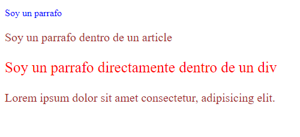

# SECCION 4: CSS

# 34. Introduccion

# 35. Nuestros primeros estilos CSS

```html
<!DOCTYPE html>
<html lang="es">
<head>
    <meta charset="UTF-8">
    <meta name="viewport" content="width=device-width, initial-scale=1.0">
    <title>Mi primera pagina web con estilos CSS</title>

    <!-- Primera forma -->
    <link rel="stylesheet" href="estilos.css">

    <!-- Segunda Forma -->
    <!-- <style>
        body {
            color: red;
        }
    </style> -->
</head>
<body>
    <h1>Hola Mundo</h1>
    <p>
        Lorem ipsum, dolor sit amet consectetur adipisicing elit. Quidem veritatis, et harum magnam odit asperiores sequi doloribus, saepe provident placeat iusto? Quis facilis optio, quidem magnam fugit quaerat voluptas facere.
    </p>
</body>
</html>
```

```css
/*
Estructura de una regla CSS
body <---> Selector, al elemento al que le queremos aplicar los efectos
color <---> Propiedad, efecto o cambio que le queremos dar al o los elementos
blue: <---> Valor que le daremos a la propiedad
*/

body {
    color: blue;
}
```

# 36. Selectores (Parte 1)

```html
<!DOCTYPE html>
<html lang="en">
<head>
    <meta charset="UTF-8">
    <meta name="viewport" content="width=device-width, initial-scale=1.0">
    <title>Selectores</title>
    <link rel="stylesheet" href="selectores.css">
</head>
<body>
    <h1>Hola mundo</h1>
    <p>Lorem ipsum dolor sit, amet consectetur adipisicing elit. Sequi repellendus reiciendis.</p>
    <div>
        <p>Soy un parrafo <a href="#">dentro</a> de un div</p>
    </div>
    <div>
        <article>
            <p>Soy un parrafo dentro de un div y un article</p>
        </article>
    </div>
    <a href="#">Soy un enlace</a>
    <a href="#">Soy otro enlace</a>
</body>
</html>
```

```css
/* Selector Universal
* {
    color: red;    
} */

h1 {
    color: blue;
}

/* h1, h2, h3 {
    color: blue;
} */

div p {
    font-size: 20px;
    color: black;
}

div article p {
    font-size: 30px;
    color: green;
}

p a {
    font-size: 25;
    color: pink;
}

/* Mas especifico
div p a {
    font-size: 25;
    color: pink;
} */
```


# 37. Selectores (Parte 2)

```html
<!DOCTYPE html>
<html lang="en">
<head>
    <meta charset="UTF-8">
    <meta name="viewport" content="width=device-width, initial-scale=1.0">
    <title>Selectores</title>
    <link rel="stylesheet" href="selectores.css">
</head>
<body>
    <h1>Hola mundo</h1>
    <p>Lorem ipsum dolor sit, amet consectetur adipisicing elit. Sequi repellendus reiciendis.</p>
    <div>
        <p>Soy un parrafo <a href="#">dentro</a> de un div</p>
    </div>
    <div>
        <article>
            <p>Soy un parrafo dentro de un div y un article</p>
        </article>
    </div>
    <a href="#" class="grande">Soy un enlace</a>
    <a href="#" class="grande" id="rojo">Soy otro enlace</a>
</body>
</html>
```

```css
.grande {
    font-size: 28px;
}

/* Los id no se suelen usar para estilos, lo recomendable solo usar class */
#rojo {
    color: red;
}

/* Se puede hacer diferentes combinaciones
.main article p {

} */
```


# 38. Selectores Avanzados

```html
<!DOCTYPE html>
<html lang="en">
<head>
    <meta charset="UTF-8">
    <meta name="viewport" content="width=device-width, initial-scale=1.0">
    <title>Selectores Avanzados</title>
    <link rel="stylesheet" href="selectoresAvanzados.css">
</head>
<body>
    <p>Soy un parrafo</p>
    <div>
        <article>
            <p>Soy un parrafo dentro de un article</p>
        </article>
    </div>
    <div>
        <p>
            Soy un parrafo directamente dentro de un div
        </p>
    </div>
    <article>
        Lorem ipsum dolor sit amet consectetur, adipisicing elit.
    </article>
</body>
</html>
```

```css
/* Seleccionamos solo los parrafos que sean hijos directos de un div */
div > p {
    font-size: 25px;
    color: red;
}

/* 
input[type] {

}

input [type="text"] {

} 
*/

/* Herencia */
body {
    font-size: 16px;
    color: blue;
}

article {
    font-size: 20px;
    color: brown;
}
```



# 39. Fondos

Recursos:

- https://html-color-codes.info/codigos-de-colores-hexadecimales/
- https://unsplash.com/es/fotos/cordillera-con-hierba-verde-ladera-Lzx4J_Pb3sk
- https://www.toptal.com/designers/subtlepatterns/

```html
<!DOCTYPE html>
<html lang="es">
<head>
    <meta charset="UTF-8">
    <meta name="viewport" content="width=device-width, initial-scale=1.0">
    <title>Fondos</title>
    <link rel="stylesheet" href="fondo.css">
</head>
<body>
    <!-- <article>
        <p>Lorem ipsum dolor sit, amet consectetur adipisicing elit. Magni, beatae? Amet, nihil laboriosam eius est distinctio nesciunt alias nemo autem totam doloremque excepturi, molestias dolorum dignissimos aliquam enim, odit similique?</p>
        <br><br><br><br>
        <p>Lorem ipsum dolor sit, amet consectetur adipisicing elit. Magni, beatae? Amet, nihil laboriosam eius est distinctio nesciunt alias nemo autem totam doloremque excepturi, molestias dolorum dignissimos aliquam enim, odit similique?</p>
        <br><br><br><br>
        <p>Lorem ipsum dolor sit, amet consectetur adipisicing elit. Magni, beatae? Amet, nihil laboriosam eius est distinctio nesciunt alias nemo autem totam doloremque excepturi, molestias dolorum dignissimos aliquam enim, odit similique?</p>
        <br><br><br><br>
        <p>Lorem ipsum dolor sit, amet consectetur adipisicing elit. Magni, beatae? Amet, nihil laboriosam eius est distinctio nesciunt alias nemo autem totam doloremque excepturi, molestias dolorum dignissimos aliquam enim, odit similique?</p>
        <br><br><br><br>
        <p>Lorem ipsum dolor sit, amet consectetur adipisicing elit. Magni, beatae? Amet, nihil laboriosam eius est distinctio nesciunt alias nemo autem totam doloremque excepturi, molestias dolorum dignissimos aliquam enim, odit similique?</p>
        <br><br><br><br>
        <p>Lorem ipsum dolor sit, amet consectetur adipisicing elit. Magni, beatae? Amet, nihil laboriosam eius est distinctio nesciunt alias nemo autem totam doloremque excepturi, molestias dolorum dignissimos aliquam enim, odit similique?</p>
        <br><br><br><br>
        <p>Lorem ipsum dolor sit, amet consectetur adipisicing elit. Magni, beatae? Amet, nihil laboriosam eius est distinctio nesciunt alias nemo autem totam doloremque excepturi, molestias dolorum dignissimos aliquam enim, odit similique?</p>
        <br><br><br><br>
        <p>Lorem ipsum dolor sit, amet consectetur adipisicing elit. Magni, beatae? Amet, nihil laboriosam eius est distinctio nesciunt alias nemo autem totam doloremque excepturi, molestias dolorum dignissimos aliquam enim, odit similique?</p>
        <br><br><br><br>
        <p>Lorem ipsum dolor sit, amet consectetur adipisicing elit. Magni, beatae? Amet, nihil laboriosam eius est distinctio nesciunt alias nemo autem totam doloremque excepturi, molestias dolorum dignissimos aliquam enim, odit similique?</p>
    </article> -->
    <div class="fondo"></div>
</body>
</html>
```

```css
/* body {
    background: #5F04B4;
} */

/* body {
    background: url(img/paisaje.jpg);
    background-size: cover;
    background-repeat: no-repeat;
    background-attachment: fixed;
    background-position: center;
} */

/* Otra forma
body {
    background: url(img/paisaje.jpg) no-repeat fixed center;
    background-size: cover;
} */

/* .fondo {
    width: 600px;
    height: 600px;
    background: url(img/paisaje.jpg) #000;
    background-repeat: no-repeat;
    background-size: 50%;
} */

body {
    background: url(img/moroccan-flower.png);
    background-repeat: repeat;
    background-attachment: scroll;
}
```

# 40. Gradientes

Ya no se usan muchos gradientes en la actualidad

Recurso: https://www.colorzilla.com/gradient-editor/

```html
<!DOCTYPE html>
<html lang="es">
<head>
    <meta charset="UTF-8">
    <meta name="viewport" content="width=device-width, initial-scale=1.0">
    <title>Gradiente</title>
    <link rel="stylesheet" href="gradientes.css">
</head>
<body>
    <div class="fondo"></div>
</body>
</html>
```

```css
.fondo {
    width: 500px;
    height: 300px;

    /* Gradiente generado por la pagina de recurso */
    background: linear-gradient(to bottom, rgba(255, 183, 107, 1) 0%, rgba(255, 167, 61, 1) 50%, rgba(255, 124, 0, 1) 51%, rgba(255, 127, 4, 1) 100%);
}
```

# 41. Enlaces

```html
<!DOCTYPE html>
<html lang="en">
<head>
    <meta charset="UTF-8">
    <meta name="viewport" content="width=device-width, initial-scale=1.0">
    <title>Enlaces</title>
    <link rel="stylesheet" href="enlaces.css">
</head>
<body>
    <a href="#">Enlace</a>
    <a href="https://ww.google.com">Google</a>
</body>
</html>
```

```css
a {
    font-size: 20px;
    text-decoration: none;
}


/* 
El pseudo-clase :hover en CSS es una herramienta poderosa para mejorar la interactividad y la experiencia de usuario en una página web. Se usa para aplicar estilos específicos a un elemento cuando el usuario coloca el cursor sobre él (hover), sin hacer clic. Se aplica directamente a un selector en CSS, y los estilos definidos dentro de :hover se activan cuando el cursor se coloca sobre el elemento correspondiente.

*/
a:hover {
    background: #f9a03f;
    color: #fff;
}

/* Enlace sin visitar */
a:link {
    text-decoration: none;
}

/* Enlace visitado */
a:visited {
    color: aqua;
}

/* Estado del enlace mientras se esta haciendo click */
a:active {
    text-decoration: underline;
}
```

# 42. Texto y Tipografia

```html
<!DOCTYPE html>
<html lang="en">

<head>
    <meta charset="UTF-8">
    <meta name="viewport" content="width=device-width, initial-scale=1.0">
    <title>Tipografia</title>
    <link rel="stylesheet" href="tipografia.css">
</head>

<body>
    <p>
        Lorem ipsum dolor sit amet consectetur, adipisicing elit. Aliquid enim ratione, voluptatibus libero doloribus
        exercitationem quas nam, impedit ullam soluta sed labore quo magni atque aspernatur laboriosam facere maxime
        dicta!
        <br><br>
        Lorem ipsum dolor sit amet consectetur, adipisicing elit. Aliquid enim ratione, voluptatibus libero doloribus
        exercitationem quas nam, impedit ullam soluta sed labore quo magni atque aspernatur laboriosam facere maxime
        dicta!
        <br><br>
        Lorem ipsum dolor sit amet consectetur, adipisicing elit. Aliquid enim ratione, voluptatibus libero doloribus
        exercitationem quas nam, impedit ullam soluta sed labore quo magni atque aspernatur laboriosam facere maxime
        dicta!
        <br><br>
        Lorem ipsum dolor sit amet consectetur, adipisicing elit. Aliquid enim ratione, voluptatibus libero doloribus
        exercitationem quas nam, impedit ullam soluta sed labore quo magni atque aspernatur laboriosam facere maxime
        dicta!
        <br><br>
    </p>
    <h1>Encabezado H1</h1>
    <h2>Encabezado H2</h2>
    <h3>Encabezado H3</h3>
    <h4>Encabezado H4</h4>
    <h5>Encabezado H5</h5>
    <h6>Encabezado H6</h6>
</body>

</html>
```

```css
body {
    font-family: Arial, Helvetica, sans-serif;
}

p {
    text-align: justify;
    text-transform: capitalize;
    letter-spacing: 5px;
    line-height: 30px;
}

h1 {
    font-family: 'Times New Roman', Times, serif;
    font-size: 28px;
    font-style: italic;
    font-weight: normal;
    color: #4281ed;
    text-align: left;
    text-decoration: underline;
    text-transform: uppercase;
}
```


# 43. Unidades de medida

```html
<!DOCTYPE html>
<html lang="en">

<head>
    <meta charset="UTF-8">
    <meta name="viewport" content="width=device-width, initial-scale=1.0">
    <title>Unidades de Medida</title>
    <link rel="stylesheet" href="unidadesMedida.css">
</head>

<body>
    <p>
        Lorem ipsum dolor sit amet consectetur adipisicing elit. Quis, vel maxime? Excepturi officia sapiente
        accusantium officiis delectus sint. Accusamus officiis repudiandae blanditiis fugit modi eius sunt, nulla quo
        nemo saepe.
    </p>
    <p>
        Lorem ipsum dolor sit amet consectetur adipisicing elit. Quis, vel maxime? Excepturi officia sapiente
        accusantium officiis delectus sint. Accusamus officiis repudiandae blanditiis fugit modi eius sunt, nulla quo
        nemo saepe.
    </p>
    <div class="contenedor-padre">
        <div class="hijo">
            Lorem ipsum dolor sit.
        </div>
    </div>

</body>

</html>
```

```css
body {
    font-size: 16px;
}

/* p {
    font-size: 30px;
} */

p {
    font-size: 1.5em;
}

.contenedor-padre {
    font-size: 20px;
}

.hijo {
    width: 10rem;
    height: 10rem;
    background: #000;
    color: white;
}

/* 
em: La unidad em es relativa al tamaño de fuente del elemento padre inmediato. Esto significa que su valor cambia dependiendo del contexto en el que se utiliza. Se utiliza a menudo para establecer tamaños de fuente, márgenes, paddings, y otros aspectos de diseño de manera que escalen de acuerdo con el tamaño de la fuente del elemento padre. Si el tamaño de fuente del elemento padre es de 16px, entonces 1em será igual a 16px

rem: La unidad rem es relativa al tamaño de la fuente de la raíz del documento (específicamente el elemento <html>). Es más predecible y consistente que em porque no se ve afectada por la cascada de estilos de los elementos padres. Se utiliza para mantener consistencia en el diseño, ya que siempre se basa en el tamaño de fuente raíz del documento. Esto es especialmente útil en diseños responsivos y cuando se necesita evitar el "efecto cascada" de em. Si el tamaño de fuente del elemento <html> es de 16px (el valor por defecto en la mayoría de los navegadores), entonces 1rem será igual a 16px.
*/
```


# 44. Unidades de color

Recursos: 
- https://coolors.co/
- https://html-color-codes.info/codigos-de-colores-hexadecimales/

```html
<!DOCTYPE html>
<html lang="en">
<head>
    <meta charset="UTF-8">
    <meta name="viewport" content="width=device-width, initial-scale=1.0">
    <title>Unidades de color</title>
    <link rel="stylesheet" href="unidadesColor.css">
</head>
<body>
    <div class="caja"></div>
</body>
</html>
```

```css
/* 
Colores por nombre: CSS incluye una lista de colores predeterminados que pueden ser referenciados por nombre. Estos nombres representan colores comunes como red, blue, green, etc.

Hexadecimal: Los colores hexadecimales se especifican con un signo # seguido de seis dígitos que representan los valores de los componentes rojo (R), verde (G) y azul (B) en formato hexadecimal.

RGB: Especifica los colores mediante la combinación de los valores de los componentes rojo, verde y azul en formato decimal. Formato: rgb(255, 87, 51), donde cada valor va de 0 a 255.

RGBA: Es una extensión de RGB que añade un cuarto componente, alpha, para controlar la opacidad (transparencia) del color. Formato: rgba(255, 87, 51, 0.5), donde el valor de alpha varía de 0 (totalmente transparente) a 1 (totalmente opaco).

*/

/* .caja {
    width: 200px;
    height: 200px;
    background: #000;
} */

/* .caja {
    width: 200px;
    height: 200px;
    background: rgb(215, 38, 61);
} */

/* .caja {
    width: 200px;
    height: 200px;
    background: #328BF0;
} */

.caja {
    width: 200px;
    height: 200px;
    background: rgba(215, 38, 61, 0.2);
}
```

# 45. Modelo de caja

```html
<!DOCTYPE html>
<html lang="en">
<head>
    <meta charset="UTF-8">
    <meta name="viewport" content="width=device-width, initial-scale=1.0">
    <title>Modelo de Caja</title>
    <link rel="stylesheet" href="modeloCaja.css">
</head>
<body>
    <div class="caja">
        <p>
            Lorem ipsum dolor sit amet consectetur adipisicing elit. Ex quos sequi placeat aliquam dolorem cupiditate nostrum officia!.
        </p>
    </div>
    <div class="caja">
        <p>
            Lorem ipsum dolor sit amet consectetur adipisicing elit. Ex quos sequi placeat aliquam dolorem cupiditate nostrum officia!. Ex quos sequi placeat aliquam dolorem cupiditate nostrum officia!. Ex quos sequi placeat aliquam dolorem cupiditate nostrum officia!. cupiditate nostrum officia!
        </p>
    </div>
</body>
</html>
```

```css
* {
    padding: 0;
    margin: 0;
}

body {
    font-family: Arial, Helvetica, sans-serif;
    line-height: 22px;
}

.caja {
    background: #0353a4;
    width: 200px;
    /* height: 200px; */
    margin: 20px;
    padding: 20px;
    /* margin-top: 20px;
    margin-right: 10px;
    margin-bottom: 5px;
    margin-left: 0px; */
    border: 8px solid #000;
}

.caja p{
    background: #eee5e9;
}
```


# 46. Tipo de elementos

```html
<!DOCTYPE html>
<html lang="en">
<head>
    <meta charset="UTF-8">
    <meta name="viewport" content="width=device-width, initial-scale=1.0">
    <title>Tipos de Elementos</title>
    <link rel="stylesheet" href="tiposElementos.css">
</head>
<body>
    <h1>Hola, soy un encabezado</h1>
    <p>Yo soy un parrafo <a href="#">Soy un enlace dentro de un parrafo</a></p>
    <div>Yo soy un contenedor div</div> 
    <a href="#">Soy un enlace</a>
    <a href="#">Soy otro enlace</a>
</body>
</html>
```

```css
/* 
Elementos en bloque: Los elementos en bloque son aquellos que ocupan todo el ancho disponible de su contenedor, lo que significa que, por defecto, se extienden a lo largo de la página (de izquierda a derecha en un documento de flujo normal). Comienzan en una nueva línea y empujan el contenido siguiente hacia abajo.
Ejemplos comunes: div, p, h1,h2,h3,ul,ol,li,section,article,header,footer

Elementos en línea: Los elementos en línea solo ocupan el espacio necesario para su contenido y no fuerzan una nueva línea después de ellos. Se alinean uno al lado del otro horizontalmente si hay espacio disponible.
Ejemplos comunes: span, a, img, strong, br, button, textarea
 */

body {
    background: #f2f2f2;
    font-family: Arial, Helvetica, sans-serif;
}

h1, p, div {
    background: #ccc;
    padding: 10px;
    width: 500px;
    display: inline-block;
}

/* a {
    color: #fff;
    background: #000;
    padding: 10px;
} */

/* Por defecto a los elementos de tipo linea no se le pueden agregar un padding, width, height, pero se pueden convertir, haciendo lo siguiente: */

/* El valor inline-block de la propiedad CSS display es una combinación útil que permite a un elemento comportarse como un elemento en línea pero con algunas características de los elementos en bloque. Este comportamiento híbrido es particularmente valioso cuando se desea que un elemento mantenga ciertas propiedades de los elementos en línea y de los elementos en bloque. */

a {
    color: #fff;
    background: #000;
    padding: 10px;
    display: inline-block;
    height: 50px;
}
```


# 47. [PRACTICA] Diseñando unos botones con CSS

```html
<!DOCTYPE html>
<html lang="en">

<head>
    <meta charset="UTF-8">
    <meta name="viewport" content="width=device-width, initial-scale=1.0">
    <title>Botones</title>
    <link rel="stylesheet" href="botones.css">
</head>

<body>
    <div>
        <a href="#" class="btn">Boton Standar</a>
    </div>

    <div>
        <a href="#" class="btn small">Pequeño</a>
        <a href="#" class="btn medium azul">Mediano</a>
        <a href="#" class="btn big verde">Grande</a>
        <a href="#" class="btn extra-big naranja">Extra Grande</a>
    </div>

    <div>
        <a href="#" class="btn small border-radius">Pequeño</a>
        <a href="#" class="btn medium azul border-radius">Mediano</a>
        <a href="#" class="btn big verde border-radius">Grande</a>
        <a href="#" class="btn extra-big naranja border-radius">Extra Grande</a>
    </div>


</body>

</html>
```

```css
body {
    background: #f2f2f2;
    font-family: Arial, Helvetica, sans-serif;
}

div {
    margin: 20px 0;
}

.btn {
    background: #201C21;
    color: #fff;
    font-size: 16px;
    text-decoration: none;
    padding: 15px 20px;
    display: inline-block;
    margin: 0px 10px;
}

.btn:hover {
    opacity: 0.8;
}

/* TAMAÑOS */
.small {
    font-size: 14px;
    padding: 10px 15px;
}

.medium {
    font-size: 16px;
    padding: 15px 20px;
}

.big {
    font-size: 18px;
    padding: 20px 25px;
}

.extra-big {
    font-size: 20px;
    padding: 25px 30px;
}

/* COLORES */
.azul {
    background: blue;
}

.verde {
    background: green;
}

.naranja {
    background: orange;
}

/* EFECTOS */
.border-radius {
    border-radius: 50px;
}
```


# 48. Posicionamiento de cajas

# 49.Posicionamiento flotante

# 50. Visualizacion

# 51. [PRACTICA] Galeria de imagenes

# 52. Sombras

# 53. Bordes y bordes redondeados

# 54. Pseudo-clases

# 55. Pseudo-elementos

# 56. Listas

# 57. [PRACTICA] Diseñando un menu de navegacion horizontal

# 58. Tablas

# 59. [PRACTICA] Diseñando un formulario de contacto

# 60. Propiedad Transform

# 61. Transiciones

# 62. Animaciones

# 63. Como utilizar fuentes personalizadas

# 64. [PRACTICA] Diseñando una plantilla con float

# 65. [PRACTICA] Dandole estilos CSS a nuestro layout 1 - Inicio y header

# 66. [PRACTICA] Dandole estilos CSS a nuestro layout 2 - Main, Aside y footer